# GenoMus specifications

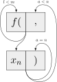

--------
## Table of Contents
- [GenoMus overview](#GenoMus-overview)
  - [Conceptual approach](#conceptual-approach)
  - [Flowchart](#flowchart) 
- [Definitions](#definitions)
- [Anatomy of a genotype function](#anatomy-of-a-genotype-function)
  - [Function name](#function-name)
  - [Input arguments](#input-argumentss)
  - [Output data structure](#output-data-structure)
  - [Genotype function template](#genotype-function-template)
- [Genotype function types](#genotype-function-types)
  - [Used function type identifiers](#used-function-type-identifiers)
  - [Main structures](#main-structures)
  - [Human-readable leaf parameters](#human-readable-leaf-parameters) 
  - [Human-readable lists](#human-readable-lists) 
  - [Domain-specific formats](#domain-specific-formats)
  - [Manual manipulation of genotypes](#manual-manipulation-of-genotypes)
- [Parameter mapping](#parameter-mapping)
  - [Duration](#duration)
    - [notevalueF (n)](#notevaluef-n)
      - [Reference table for main noteValues](#Reference-table-for-main-notevalues)
    - [durationF (d)](#durationf-d)
  - [Pitch](#pitch)
    - [midipitchF (m)](#midipitchf-m)
    - [frequencyF (f)](#frequencyf-f)
  - [Articulation](#articulation)
    - [articulationF (a)](#articulationf-a)
  - [Intensity](#intensity)
    - [intensityF (i)](#intensityf-i)
  - [Quantized steps](#quantized-steps)
    - [goldenintegerF (z)](#goldenintegerf-z)
    - [quantizedF (q)](#quantizedf-q)   
  - [rhythmF](#rhythmf)
  - [harmonyF](#harmonyf)
- [Characterization of underlying musical patterns](#characterization-of-underlying-musical-patterns)
  - [Rhythmic grid](#rhythmic-grid)
    - [totalValue](#totalvalue)
    - [talea](#talea)
    - [prolatio](#prolatio)
    - [quantization](#quantization)
    - [Example of rhythmic motives](#example-of-rhythmic-motives)
  - [Harmonic grid](#harmonic-grid)
    - [root, chord and mode](#root-chord-and-mode)
    - [chromaticism](#chromaticism)
    - [Example of harmonic grids](#example-of-harmonic-grids)
- [Function libraries](#function-libraries)  
  - [Function library data structure](#function-library-data-structure)
  - [Indexing a function in a GenoMus Function Library](#indexing-a-function-in-a-genomus-function-library)
  - [Encoded function index generation](#encoded-function-index-generation)
- [Core functions](#core-functions)
  - [Identity functions](#identity-functions)
  - [Internal autoreferences](#internal-autoreferences)
  - [External references](#external-references)
  - [Form](#form)
  - [Phrasing](#phrasing)
  - [Poliphony](#poliphony)
  - [Harmony](#harmony)
  - [Counterpoint](#counterpoint)
  - [Rhythm](#rhythm)
  - [Articulation](#articulation-1)
  - [Dynamics](#dynamics)
  - [Spectralism](#spectralism)
  - [Serialism](#serialism)
  - [Aleatoric processes](#aleatoric-processes)
  - [Algorithmic techniques](#algorithmic-techniques)
  - [List manipulation](#list-manipulation)
  - [Mathematical operations](#mathematical-operations)
  - [Manual operators of genotypes](#manual-operators-of-genotypes)
- [Encoding-decoding genotypes](#encoding-decoding-genotypes)
  - [Conversion table for genotypes](#conversion-table-for-genotypes)
  - [Formatting decoded genotypes](#formatting-decoded-genotypes)
- [Encoding-decoding phenotypes](#encoding-decoding-phenotypes)
- [Examples of specimens](#examples-of-specimens)
  - [Minimal specimen](#minimal-specimen)
  - [Minimal specimen with human-readable leaf parameters](#minimal-specimen-with-human-readable-leaf-parameters)
  - [Voice with lists](#voice-with-lists)
  - [Multiple voices and multiple scores](#multiple-voices-and-multiple-scores)
  - [Autoreferences](#autoreferences)
- [Generation, evolution and selection of specimens](#generation-evolution-and-selection-of-specimens)
  - [Initial conditions for generation of genotypes](#initial-conditions-for-generation-of-genotypes)
  - [Species characterization](#species-characterization)
  - [Eligible functions](#eligible-functions)
  - [Specimen autoanalytic profile](#specimen-autoanalytic-profile)
  - [Requested profile vector](#requested-profile-vector)
  - [Comparison of profiles](#comparison-of-profiles)
  - [Creation and manipulation of genotypes](#creation-and-manipulation-of-genotypes)
    - [Generating genoypes from random arrays](#generating-genoypes-from-random-arrays)
  - [Genotype substructures](#genotype-substructures)
    - [Subexpressions and autoreferences](#subexpressions-and-autoreferences)
    - [Branches and leaves](#branches-and-leaves)
  - [Evolution of specimens](#evolution-of-specimens)
    - [Flowchart](#flowchart-1)
    - [Selecting and processing specimens](selecting-and-processing-specimens) 
  - [Specimen data structure](#specimen-data-structure)
  - [Specimen catalogue](#specimen-catalogue)
    - [Naming](#naming)
    - [Classification](#classification)
    - [Catalogue access](#catalogue-access)
- [Max user interface](#max-user-interface)

----------
# GenoMus overview
## Conceptual approach
## Flowchart 

----------  
# Definitions
- **genotype**: Function tree representing compositional procedures.
- **phenotype**: Music score generated by a genotype.
- **encoded genotype**: Genotype coded as an array of normalized floats within the closed interval [0, 1].
- **decoded genotype**: Genotype coded as a string that contains a function tree, executable in JavaScript.
- **encoded phenotype**: Phenotype coded as an array of normalized floats within the closed interval [0, 1].
- **decoded phenotype**: Phenotype converted to a format for notation or audio software, such as Max, Csound, Lilypond, etc.
- **specimen**: Genotype/phenotype pair, saved as a JSON file containing encoded and decoded versions of its code, metadata and many other useful analytical informations.
- **subspecimen**: each of the substructures of a specimen. Its format is a dictionary containing a genotype/phenotype pair along with other useful analytical informations.
- **species**: Group of specimens that share the same parameter structure of their simplest musical events.
- **genotype function**: Minimum computable unit of a genotype. It is designed in a modular way to easily take other genotype functions as arguments.
- **parameter**: Normalized float &isinv; [0, 1] used to feed the functions' required arguments. These numeric values are leaves of the functional tree that gives rise to a genotype.
- **leaf**: Terminal node of a genotype functional tree, containing a parameter.
- **list**: Array of parameters.
- **event**: Simplest sonic element. In traditional music writing, a note. The default atributes of an event are: [duration, pitch, articulation, intensity]. An event can contain more than one pitch. Events with more parameters can be set, for example, for electroacoustic works, where a sonic event could be defined by dozens of features. A note can consist of two or more concatenated pitches. Events can be concatenated only sequentially (one after another, without overlapping). Overlapping effect among events inside the same voice can be achieved by means of articulation. An event can be extended to other domains beyond music, like visuals, lighting, etc., along with musical events, or standalone. 
- **voice**: Line of music (usually for an only instrument). A voice is a wrapper for a sequence of one or more events. A voice can consist of two or more voices sequentially concatenated  together (one after another, without overlapping). Each event inside a voice can contain more than one pitch. For instance, a sequence of major chords can be a single voice.
- **score**: Excerpt or a whole piece of music. A score is a wrapper for one or more voices. A score can consist of two or more scores together. Scores can be concatenated sequentially (one after another) or simultaneously (sounding together). The product of these concatenations is a new score. The event-voice-score structure is partially defined after [bach](https://www.bachproject.net/) paradigm, to facilitate the visualization and interactions with phenotypes in Max environment.
- **duration**: Time length from the beginning of an event to the beginning of the next event, into the same voice. 
- **pitch**: Each of the root frecuencies in an event.
- **articulation**: Length of the event sound. It can be different from the event duration. If articulation matchs the duration, a perfect legato among events will be played. Shorter or larger values for articulation will sound as staccato or lasciare vibrare effects.
- **intensity**: Dynamics of an event.
- **GenoMus function catalog**: JSON file that lists and characterizes all the available functions for genotype generation of a species.
- **function type identifier**: Prefix used to name functions, to ease the function type identification. The use of identifiers is not compulsory, but very convenient for readability of decoded genotypes.
- **function index**: Integer assigned incrementally to identify each function with a unique number in the GenoMus functions catalogue. 
- **encoded function index**: Float generated to identify each function with a unique number. These numbers are chosen using the function index as input for an algorithm designed to obtain an optimized distribution of these normalized identifiers &isinv; [0, 1].
- **eligible functions**: Set of functions that determine which ones can be chosen during the genotype generation process. Somehow, this set can characterize a composer or a style.
- **genotype seed**: Number used to initialize the pseudorandom number generator before the genotype generation process starts. It allows repeatable results. Ultimately, a genotype can be identified only by this number, since it determines the entire decision tree that generates it.
- **phenotype seed**: Number used to initialize the pseudorandom number generator before the genotype evaluation process starts, which allows producing repeatable phenotypes. When a genotype includes random processes, many different phenotypes from the same genotype can arise. In this case, each different result can be indentified with a phenotype seed. So, given specific initial conditions, a single specimen can be identified only by two integers: genotype and phenotype seeds.
- **rhythmic grid**: Data structure that characterizes a rhythmic pattern by specifying length, talea and other features.
- **harmonic grid**: Data structure that characterizes a harmony by specifying tonal center, pitch class set and other features.
- **talea**: Array of values that represents a sequence of relative durations (updated concept taken from ancient music).
- **prolatio**: Hierarchical time grid structure.
- **quantization**: Adjustment of relatives durations of a talea to a prolatio.

---------
# Anatomy of a genotype function

## Function name
As a convenient convention to improve the understanding of the function tree, **genotype functions** are named beginning with the type identifier, a letter that identifies their type of output (see [function types for genotypes](#function-types-for-genotypes)).

## Input arguments
All genotype functions in a function tree expect arguments received from another genotype function, except if the required argument is a **leaf**. The input arguments can only come from one of the predefined types of genotype function included in the referenced [GenoMus Function Library](#function-libraries).

The names of the input arguments are of free choice.

## Output data structure 
To enable automatic chaining of functions, all functions inside a genotype share the same output data structure. This output data is returned inside a dictionary (actually a JavaScript Object) containing these keys:

key                | data type                      | description
| ---------------- | ------------------------------ | -----------
**funcType**       | string                         | [**Function type**](#genotype-function-types) according to its output.
**encGen**         | array of floats &isinv; [0, 1] | **Encoded genotype** excerpt. Numeric representation of the following functional expression.
**decGen**         | string                         | **Decoded genotype** excerpt. Functional expression of the genotype branch computed until that node, including the function itself.
**encPhen**        | array of floats &isinv; [0, 1] | **Encoded phenotype** excerpt. Transformation of the input data made with the compositional procedures of the function itself.
**phenLength**     | integer                        | **Number of events** generated so far. Useful for subsequent functions to avoid overly large processes.
**tempo**          | float                          | **Tempo** of the phenotype. The float uses the [durationF](#durationf-d) format to indicate the duration of a quarter note. Default value: 0.6 (equivalent to &#9833;= 60)
**rhythm**         | dictionary                     | [**Rhythmic grid**](#rhythmic-grid).
**harmony**        | dictionary                     | [**Harmonic grid**](#harmonic-grid).
**analysis**       | dictionary                     | **Autoanalysis** of different [musical features](#specimen-autoanalytic-profile).

First four elements are compulsory for every function inside a genotype. Informations about rhythm and harmony can be useful for subsequent functions, but they are optional. 

Variable names inside each genotype function are not compulsory, but is highly recommended to maintain the same nomenclature to improve code readability and reusability.

More fields can be added if needed, but always after the first seven preset items.

The **decoded genotype** is created only when the specimen is sent to another music software.

## Genotype function template

```
// description
var <iFunctionName> = (arg1, arg2, ..., argN) => {
    <check block>
    var funcType = "<functionType>";
    var decGen = "<iFunctionName>(" + arg1.decGen + ", " + arg2.decGen + ", " + ... + "argN.decGen + ")";
    <core block> 
    var encPhen = [<array containing the result of the transformations>];
    <analitycs block>
    return indexExprReturnSpecimen(funcType, encGen, decGen, encPhen, phenLength, tempo, rhythm, harmony, analysis);
};
```
- The **check block** verifies that the execution of the function will produce a phenotype that satisfies the constraints of the predetermined initial conditions (specially regarding encoded phenotype length). If the requirements cannot be fulfilled, the process is canceled.
- **funcType** declares the output type of the function, namely one of this [types](#genotype-function-types).
- **decGen** is the own functional expression, constructed with the respective own expressions of the functions taken as arguments. This element is essential to possibilitate internal autoreferences, recursive functions and reiterations of non-deterministic expressions.
- The **core block** executes the musical transformations of the function, writing the results in the variable encPhen, and calculating at the end of the process the updated values of phenLength, tempo, rhythm and harmony.
- **encPhen** stores the result of transformations with the encoded phenotype format, namely an unimensional array of floats within interval [0, 1].
- The **analitycs block** stores some analytical measurement to be inherited by next functions. Its goal is to facilitate the estimation of global musical characteristics to compare with the requested profile.
- **writeSubexprReturnData** stores all the subexpressions generated during the evaluation of the function tree so far, and returns the array with the [output data structure](#output-data-structure) described above.

---------
# Genotype function types
Genotype functions are classified by their output data. By convention, each type is has an identifier used as prefix for the names of all functions of that output type. 

---------
## Used function type identifiers
~~**a** **b** **c** **d** **e** **f** **g** **h** **i**~~ j k ~~**l** **m** **n** **o** **p** **q** **r** **s** **t** **u** **v** **w**~~ x y ~~**z**~~

---------
## Main structures

| function type   | identifier   | output
| --------------- | ------------ | --------
| **scoreF**      | **s**        | score
| **voiceF**      | **v**        | voice
| **eventF**      | **e**        | event
| **listF**       | **l**        | list of normalized floats &isinv; [0, 1]
| **paramF**      | **p**        | normalized parameter
| **leaf**        | -            | norm. parameter or specific format parameter

The **leaf** type is a flag for terminal nodes. This is not really a type of function, but a label to indicate that a new function will not be called.

---------
## Human-readable leaf parameters
Function types created to improve readability and manual editing of decoded genotypes. These functions can replace a **paramF** functions in a leaf position of function tree.

| function type      | identifier   | output
| ------------------ | ------------ | --------
| **notevalueF**     | **n**        | normalized duration from usual number used for note values (1 = whole note)
| **durationF**      | **d**        | normalized duration from time in seconds
| **midipitchF**     | **m**        | normalized pitch from standard MIDI pitch
| **frequencyF**     | **f**        | normalized pitch from frequency in Hz
| **articulationF**  | **a**        | normalized relative articulation (1 is whole duration of the note, 2 is double duration)
| **intensityF**     | **i**        | normalized intensity from standard MIDI velocity
| **goldenintegerF** | **z**        | normalized value from integer &isinv; [0, 514261]
| **quantizedF**     | **q**        | normalized value from integer &isinv; [-36, 36]

---------
## Human-readable lists

These functions receive a list of human-readable leaf parameters and return a normalized list, which can be seamlessly integrated into automatic processes.

| function type       | identifier   | output
| ------------------- | ------------ | --------
| **lnotevalueF**     | **ln**       | list of normalized durations from list of note values (1 = whole note)
| **ldurationF**      | **ld**       | list of normalized durations from list of duration in seconds
| **lmidipitchF**     | **lm**       | list of normalized pitches from list of MIDI pitches
| **lfrequencyF**     | **lf**       | list of normalized pitches from frequencies in Hz
| **larticulationF**  | **la**       | list of normalized relative articulations from list of relative articulations
| **lintensityF**     | **li**       | list of normalized intensities from MIDI velocities
| **lgoldenintegerF** | **lz**       | list of normalized values from list of integer &isinv; [0, 514261]
| **lquantizedF**     | **lq**       | list of normalized values from list of integer &isinv; [-36, 36]

---------
## Domain-specific formats
Function types created to manage specific types of data (some of them are still purely theoretical)

| function type   | identifier   | output
| --------------- | ------------ | --------
| **operationF**  | **o**        | result of an arithmetic operation, useful to construct recursive mathematical expressions inside a genotype
| **booleanF**    | **b**        | boolean value (only 0 or 1)
| **rhythmF**     | **r**        | rhythmic pattern (nested array of floats &isinv; [0, 1])
| **harmonyF**    | **h**        | pitch class sequence, useful for specifying scales, modes, chords, pitch aggregates, harmonic series, etc.
| **catalogueF**  | **c**        | pointer to an external genotype from a specimen catalogue (to be used with functions referencing external data)
| **genotypeF**   | **g**        | raw encoded genotype (array of floats &isinv; [0, 1])
| **txtF**        | **t**        | string
| **waveF**       | **w**        | encoded path to read data from an stored audio file

---------
## Manual manipulation of genotypes
Functions to be used typing manually on the genotypes to get a more controlled evolution.

| function type   | identifier   | output
| --------------- | ------------ | --------
| **userF**       | **u**        | these functions perform very different manipulations on part of a genotype, acting as a metalevel of functional control

User functions use uppercase letters to be easily found during manual editing processes. Some examples of this type:
- **uEVOLVE** (*expr*) - contains the part of a genotype to be transformed, freezing the rest
- **uFREEZE** (*expr*) - block a part of a genotype to be preserved from transformations
- **uFLATTEN** (*expr*) - render part of a genotype into a simple declarative score/voice/event (phenotype)

---------
# Parameter mapping
A GenoMus function tree expects generic parameters (floats &isinv; [0, 1]) as leaves, regardless arguments' domain. When computing a phenotype, these numbers must be mapped to correct ranges and scales to represent duration, pitch, etc.

Human-readable function types use specific user-friendly formats for each argument. These non generic parameters are first mapped to a normalized interval [0, 1] to be later evaluated and encoded as stardard normalized paramenters.

In general, these maps are not linear (straight line maps). For each type of parameter, a Gaussian approach is employed, trying to cover a wide range of values for each category, but at the same time modeling the conversion so that central values (specially the range [0.25, 0.75]) map to the musical values that appear more frequently.

To work seamlessly with Max, decimal part of floats are truncated to display only 6 digits on decoded genotypes.

Since each species could require new domain-specific parameters, for each new parameter a mapping similar to those presented below must be defined.

Parameter mapping is used in several contexts:
- **To display decoded genotypes** in a more human-readable way, converting normalized values to domain-specific ranges when possible.
- **To encode genotypes**, converting arguments entered manually using user-friendly function types to normalized values.
- **To render phenotypes** (scores or soundfiles), converting normalized values to domain-specific ranges.

--------
## Duration

### **notevalueF** (n) 

Input can be the usual ratio for each note value or a float. This value is relative, and its actual duration will depend on the current tempo mark. 

Conversion formulae: normalized parameter _**p**_ to note value ratio _**v**_ and inverse ([graph](https://www.desmos.com/calculator/ysm8zt5rbl)):

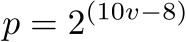
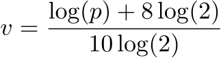
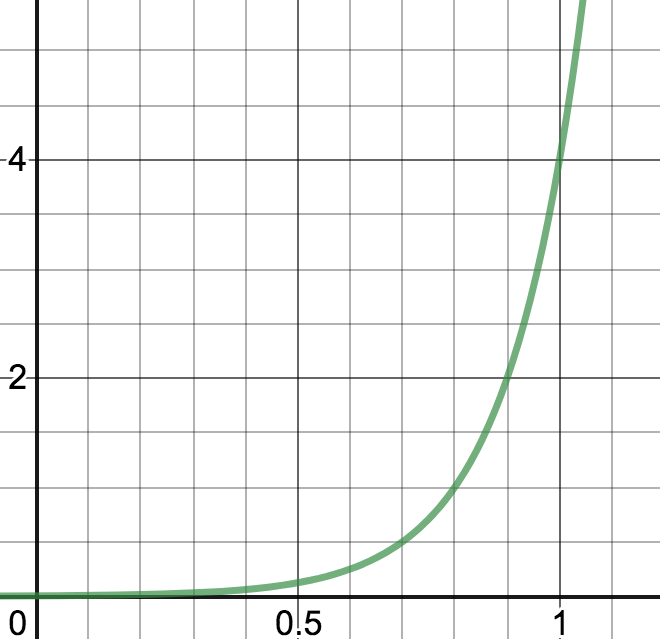

| [0, 1] | *v* (float)  | *v* (ratio) | notation (Am) / (Br)                    | seconds if &#9833;= 60 
| ------ | ------------ | ----------- | --------------------------------------- | ---------------------- 
| 0      | 0.00390625   | 1/256       | 256th note / demisemihemidemisemiquaver | 0.015625               
| 0.1    | 0.0078125    | 1/128       | 128th note / semihemidemisemiquaver     | 0.03125                
| 0.2    | 0.015625     | 1/64        | 64th note / hemidemisemiquaver          | 0.0625                 
| 0.3    | 0.03125      | 1/32        | 32th note / demisemiquaver              | 0.125                  
| 0.4    | 0.0625       | 1/16        | 16th note / semiquaver                  | 0.25                   
| 0.5    | 0.125        | 1/8         | 8th note / quaver                       | 0.5                    
| 0.6    | 0.25         | 1/4         | quarter note / crotchet                 | 1                      
| 0.7    | 0.5          | 1/2         | half note / minim                       | 2                      
| 0.8    | 1            | 1           | whole note / semibreve                  | 4                      
| 0.9    | 2            | 2           | double note / breve                     | 8                      
| 1.0    | 4            | 4           | quadruple note / longa                  | 16                     

#### Reference table for main noteValues


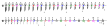

<sub>The numbers below the figures indicate note values as part of triplets and quintuplets.</sub>

### **durationF** (d) 

Conversion formulae: normalized parameter _**p**_ to seconds _**s**_ and inverse ([graph](https://www.desmos.com/calculator/pn1nbunlcz)):

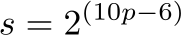
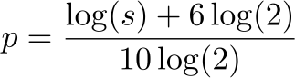
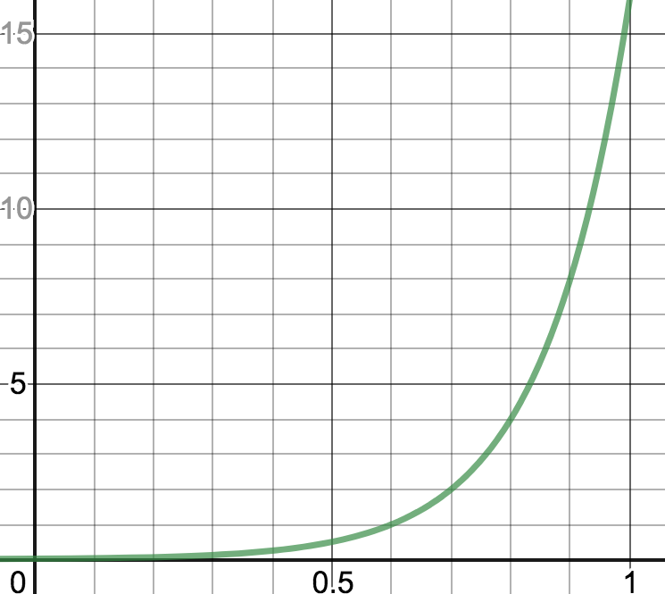

| [0, 1] |  dur. (s)   
| ------ | -------- 
| 0      | 0.015625 
| 0.1    | 0.03125  
| 0.2    | 0.0625   
| 0.3    | 0.125    
| 0.4    | 0.25     
| 0.5    | 0.5      
| 0.6    | 1        
| 0.7    | 2        
| 0.8    | 4        
| 0.9    | 8        
| 1.0    | 16       

--------
## Pitch
### **midipitchF** (m)

Linear conversion keeping encoded normalized data easily readable.

Conversion formulae: normalized parameter _**p**_ to MIDI pitch _**m**_ and inverse ([graph](https://www.desmos.com/calculator/atupolxw6d)):


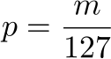
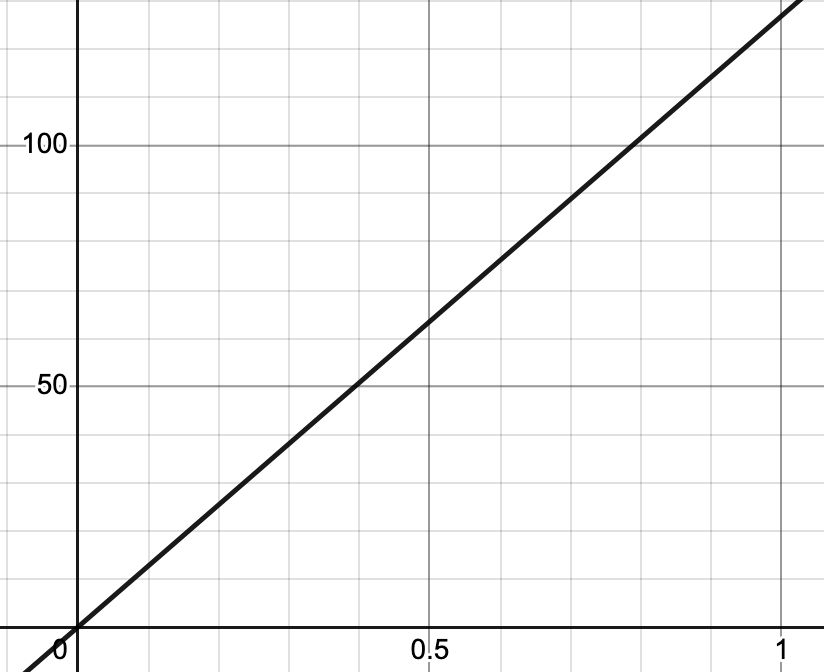

| [0, 1]  |  MIDI pitch   | Notation
| ------  | ------------- | ----------
| 0       | 0             | C<sub>-1</sub>
| 0.034   | 21            | A<sub>0</sub> <sub>(lowest piano key)</sub>
| 0.042   | 24            | C<sub>1</sub>
| 0.1     | 36            | C<sub>2</sub>
| 0.23    | 48            | C<sub>3</sub>
| 0.43    | 60            | C<sub>4</sub> <sub>(middle C)</sub>
| 0.66    | 72            | C<sub>5</sub>
| 0.83    | 84            | C<sub>6</sub>
| 0.93    | 96            | C<sub>7</sub>
| 0.97    | 108           | C<sub>8</sub> <sub>(highest piano key)</sub>
| 1.0     | 127           | E<sub>8</sub>
 

### **frequencyF** (f)

Conversion formulae: normalized parameter _**p**_ to frequency in hertz _**h**_ and inverse ([graph](https://www.desmos.com/calculator/ixocptnpba)):


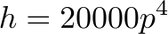
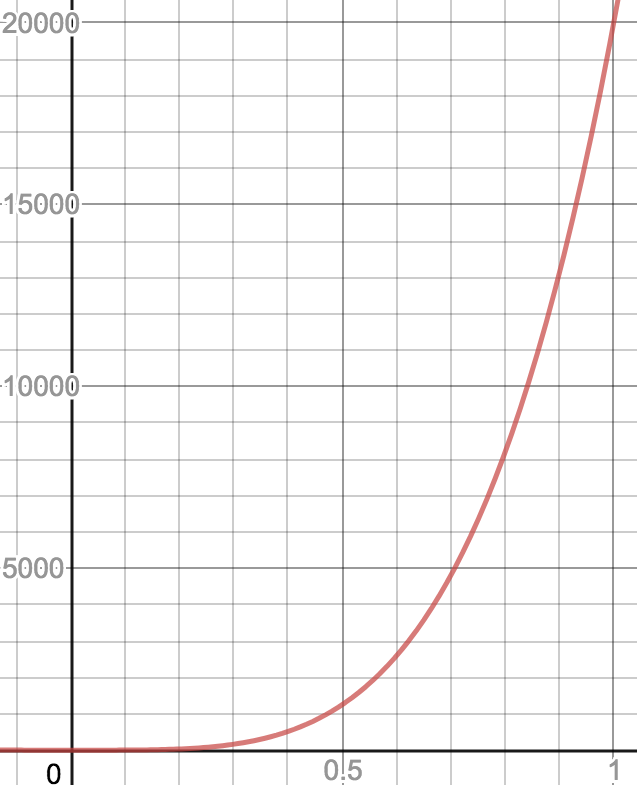

| [0, 1]   |  Hz      
| -------- | -------- 
| 0        | 0.000001 
| 0.1      | 2        
| 0.2      | 32       
| 0.3      | 162 
| 0.385129 | 440 
| 0.4      | 512      
| 0.5      | 1250     
| 0.6      | 2592     
| 0.7      | 4802     
| 0.8      | 8192     
| 0.9      | 13122    
| 1.0      | 20000    

--------
## Articulation

Articulation can be used in two modes:

- absolute articulation: The duration of the sound is measured in seconds, and is independent of tempo and event duration. The **durationF** function type is used for this articulation. 
- relative articulation: the duration of the sound is a ratio of the event duration. 1 means that the sound will last the whole duration, 0.5 is the half of the event duration, and so on. For this proportional articulation the function type **articulationF** must be employed.

### **articulationF** (a)
Conversion formulae: normalized parameter _**p**_ to relative articulation _**a**_, as a proportion of event duration ([graph](https://www.desmos.com/calculator/eo1s80cg2j)):


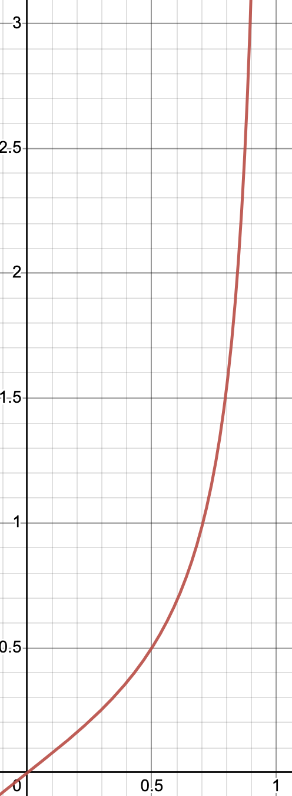

Important: This conversion includes the internal remapping of values from an uniform distribution to a gaussian one.

| [0, 1]   | % of event duration | notation
| -------- | ------------------- | --------
| 0        | 0                   | silence
| 0.1      | 11                  | *staccatissimo*
| 0.2      | 20                  | 
| 0.3      | 29                  |
| 0.4      | 39                  | *staccato*
| 0.5      | 50                  | *non legato*
| 0.6      | 65                  |
| 0.7      | 86                  |
| 0.746    | 1                   | *legato*
| 0.7      | 1.137769            |
| 0.8      | 123                 | *legatissimo*
| 0.9      | 225                 |
| 0.95     | 447                 | sustained notes
| 0.97     | 89                  |
| 1.0      | virtual infinite    | *lasciare vibrare*

--------
## Intensity
### **intensityF** (i)
Conversion formulae: normalized parameter _**p**_ to intensity _**i**_ in standard MIDI velocity and inverse ([graph](https://www.desmos.com/calculator/cisndyw3gs)):

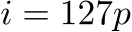

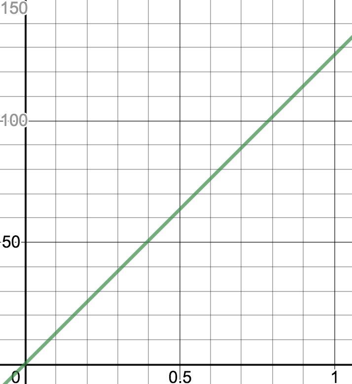

| [0, 1] | MIDI velocity | notation
| ------ | ------------- | --------
| 0      | 0             |  silence
| 0.06   | 7.62          | **_pppp_**
| 0.15   | 19.05         | **_ppp_**
| 0.25   | 31.75         | **_pp_**
| 0.33   | 41.91         | **_p_**
| 0.4    | 50.8          | **_mp_**
| 0.5    | 63.5          | **_mf_**
| 0.66   | 83.82         | **_f_**
| 0.75   | 95.25         | **_ff_**
| 0.9    | 114.3         | **_fff_**
| 1.0    | 127           | *tutta forza*

---------
## Quantized steps
### **goldenintegerF** (z)

A function of type goldenintegerF is useful for contexts where positive integer numbers are needed, but relative big distances among consecutives integers are convenient when they are normalized. When converted to normalized values, a sequence of *golden integers* always maintains a balanced distribution over the entire interval [0, 1], regardless of the number of elements employed. However, when the number of elements coincides with a Fibonacci number, the distribution is optimal.  

This conversion is specifically used to assign numeric identifiers to indexed elements such as functions or genotype subexpressions.

This format takes advantage of the golden angle properties using this formula to map integers _**z**_ &#8712; [0, 514261] to normalized parameter _**p**_ &#8712; [0, 1] and inverse:

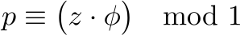

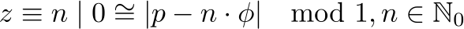


where *&#981;* is the golden ratio (&#8776; 1.618034):

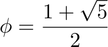

Normalized values are rounded to have only six digits after the decimal point. Using this truncated format there are 514262 different values available until a recurrence occurs.

This graph shows the distribution of the first 100 positive integers mapped within interval [0, 1] :

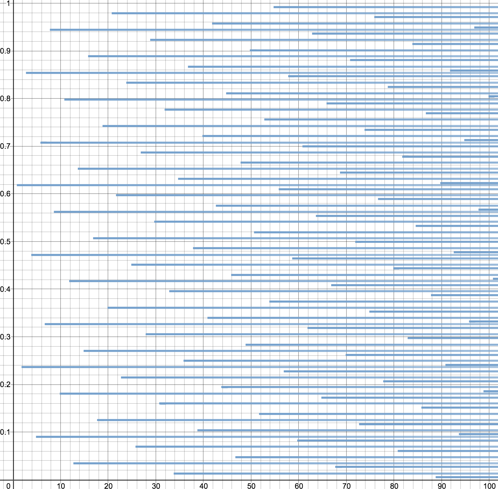

| golden integer | [0, 1]
| -------------- | ------
| 0              | 0
| 1              | 0.618034
| 2              | 0.236068
| 3              | 0.854102
| 4              | 0.472136
| 5              | 0.09017
| 6              | 0.708204
| ...            | ...

---------
### **quantizedF** (q)

This format is useful for different contexts where integer numbers can be much more readable, but only small positive and negative quantities are needed. A possible application may be, for instance, to write a sequence of melodic intervals using a diatonic scale as the step basis. 

Conversion formulae: normalized parameter _**p**_ to quantized steps _**q**_ ([graph](https://www.desmos.com/calculator/3vy4gwjxcu)):

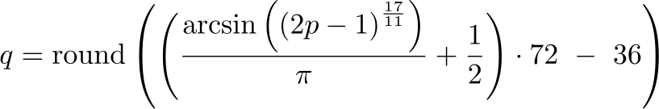

The inversion is made with a lookup table.

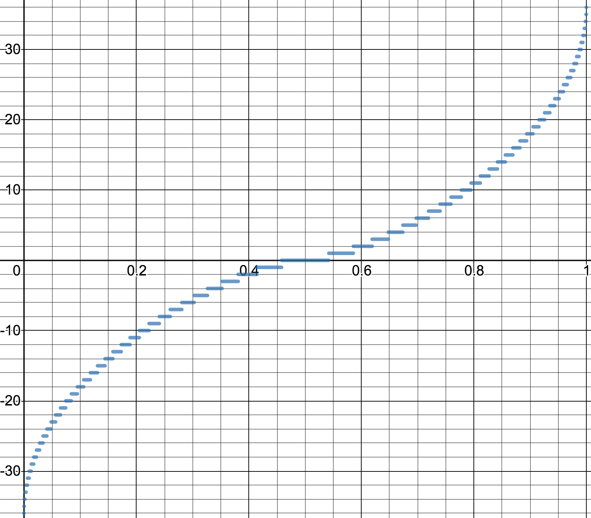

| [0, 1] |  integer steps      
| ------ | -------------------
| 0      | -36                   
| 0.0005 | -35                
| 0.001  | -34               
| 0.003  | -33               
| 0.006  | -32               
| 0.008  | -31                
| 0.01   | -30                
| 0.015  | -29               
| 0.02   | -28               
| 0.025  | -27               
| 0.03   | -26                 
| 0.04   | -25                 
| 0.045  | -24                 
| 0.05   | -23                 
| 0.06   | -22                 
| 0.07   | -21
| 0.08   | -20                 
| 0.09   | -19               
| 0.1    | -18               
| 0.11   | -17               
| 0.12   | -16                 
| 0.14   | -15                 
| 0.15   | -14                 
| 0.16   | -13                 
| 0.18   | -12                 
| 0.2    | -11
| 0.21   | -10
| 0.23   | -9               
| 0.25   | -8               
| 0.27   | -7               
| 0.3    | -6                 
| 0.32   | -5                 
| 0.33   | -4                 
| 0.36   | -3                 
| 0.4    | -2                 
| 0.45   | -1
| 0.5    | 0
| 0.55   | 1
| 0.6    | 2
| 0.64   | 3
| 0.67   | 4
| 0.68   | 5
| 0.7    | 6
| 0.73   | 7
| 0.75   | 8
| 0.77   | 9
| 0.79   | 10
| 0.8    | 11
| 0.82   | 12
| 0.84   | 13
| 0.85   | 14
| 0.86   | 15
| 0.88   | 16
| 0.89   | 17
| 0.9    | 18
| 0.91   | 19
| 0.92   | 20
| 0.93   | 21
| 0.94   | 22
| 0.95   | 23
| 0.955  | 24
| 0.96   | 25
| 0.97   | 26
| 0.975  | 27
| 0.98   | 28
| 0.985  | 29
| 0.99   | 30
| 0.992  | 31
| 0.994  | 32
| 0.997  | 33
| 0.999  | 34
| 0.9995 | 35
| 1      | 36


---------
## rhythmF

The output of a **rhythmF** function is an abstract time grid determined by a nested array with relative durations. This grid is called **prolatio**, and is used to quantize the values of a rhythmic pattern. 

The values inside a prolatio array are not absolute durations, but only proportions among themselves. For example, *prolationes* `[3,1,4]` and `[0.63,0.21,0.84]` are equivalent. A prolatio need a reference value to be rendered as a series of durations. Application of this prolatio to a half note (1/2) as total length:


Each value of a prolatio can in turn be subdivided into another prolatio using a subarray in the next position. The last value in this prolatio can be subdivided in this way:

`[3,1,4,[1,1,1,1,1]]`, with this result:

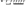

Obviously, each subarray must have at least two values to produce a subdivision at the next depth level of the prolatio. A prolatio with the scheme `[a,[d,e],b,c,[f,g,[i,j],h]]` has three level of subdivisions of the duration set by the variable **totalValue**:

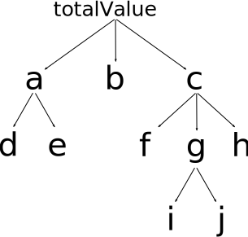

Prolationes can be arbitrarily complex. A simple array like `[1,[2,3],1,[1,[1,4],4,2],1,[1,1,[3,4,4]]]` produces nested tuplets (with a whole note as total duration):

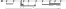

If more levels of subdivision are required but not specified, simple binary subdivisions are made by default.

These examples use integers for simplicity, but the output of a rhythmF function is always a nested array including only floats &isinv; [0, 1]. For instance, the last example of prolatio would be rescaled so that the maximum value was 1, returning this normalized nested array:

`[0.25,[0.5,0.75],0.25,[0.25,[0.25,1],1,0.5],0.25,[0.25,0.25,[0.75,1,1]]]`

All the functions working with a prolatio perform a normalization before processing or returning data, so simple proportions of integers as in the previous examples can be manually introduced in a decoded genotype. 

---------
## harmonyF

The output of a **harmonyF** function is a sequence of floats within interval \[0, 12\). 

This array is not a pitch class set but a pitch class sequence, because in some contexts the order determines certain algorithmic operations. However, this format can also serve as a pitch class set when needed.

Numbers represent pitches with the usual pitch class notation (0 = C, 1 = C&#9839;, etc), but in many occasions these pitches are transposed. So it is better to contemplate this sequence as an abstract series of intervals, in which C is used as baseline by default. Values can include a decimal part to denotate microtonal intervals.


---------
# Characterization of underlying musical patterns

During the evaluation of a genotype function tree, functions complement output data with auxiliary information concerning underlying musical patterns regarding to rhythm and harmony. These data are useful for the analysis and automatic characterization of genotypes, and for certain functions that use this data directly for the evaluation of phenotypes.

Other characteristics beyond rhythm and harmony can be added according to the needs and the event format of each species.

---------
## Rhythmic grid

A rhythmic pattern can be expressed as a dictionary containing informations to be used by other functions to map durations. These data represent a rhythmic pattern and its interrelations with a time grid and with the level of general quantization. Using this dictionary, certain functions adjust their values to get different rhythmic structures and analytical information.

A **rhythmic grid** is coded into an array following this data structure:

| index | feature          | data format          | description
| ----- | ---------------- | -------------------- | ----------- 
| 0     | **totalValue**   | notevalueF           | pattern length
| 1     | **talea**        | rhythmF              | rhythmic pattern (regardless of central value)
| 2     | **prolatio**     | rhythmF              | successive levels of divisions in the time grid to which the rhythmic values will be adjusted
| 3     | **quantization** | float &isinv; [0, 1] | degree of adjustment to quantization scheme (higher means more rhythmic complexity)

---------
### totalValue

The duration of reference to perform all rhythmic pattern transformations is determined by **totalValue**, formatted according to the mapping of [**notevalueF**](#notevaluef-n) functions.

---------
### talea

A **talea** is a rhythmic pattern, a sequence of numbers representing relative durations. Its format can be a simple float array (no normalization is required), or can be derived from a nested array as output of a [**rhythmF**](#rhythmf) function.

The order of values in a **talea** matters, because the position within the sequence determines the priority of taken values for low degrees of quantization (the first, the most important).

---------
### prolatio

A **prolatio** is a nested time grid used to adjust the raw values received from a talea. A prolatio follow the format of [**rhythmF**](#rhythmf) functions output. 

---------
### quantization

| quantization | result
| ------------ | ------
| 0            | all values are quantized to the totalValue duration (all events are played simultaneously, prolatio is not taken into account)
| (0, 1)       | gradual quantization using progressive levels of prolatio depth
| 1            | no quantization applied, values mapped with full rhythmic resolution (prolatio is not taken into account)

---------
### Example of rhythmic motives

The following tables show how increasing degrees of quantization of this rhythmic grid: 

```
{
    totalValue: 1,
    talea: [0.1,0.1,0.4,0.8,0.4,0.5],
    prolatio: [2,[1,[1,1],1,[1,1],1],4,1,[2,[3,1],1,1],1,[2,1]],
    quantization: <float within interval [0, 1]>
}
```

First of all, the talea `[0.1,0.1,0.4,0.8,0.4,0.5]` is rescaled to `[0.044,0.044,0.174,0.348,0.174,0.216]` Now, the sum of all the numbers in the sequence is 1. The relative durations of this talea can be visualized as horizontal segments: 

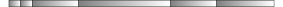

The next step is to determine quantization thresholds based on the prolatio depth levels. In this example, the prolatio has three levels that are mapped to the intervals (0, &#8531;], (&#8531;, &#8532;] and (&#8532;, 1).

| **quantization** = 0                               | totalValue = 1 <sub>(whole note)</sub>
| -------------------------------------------------- | -----
| **raw talea** (rescaled)                           | `[0.044,0.044,0.174,0.348,0.174,0.216]`
| **prolatio** depth = 0 (code)                      | Prolatio is not used, all values converge to **totalValue**
| **prolatio** depth = 0 (score)                     | 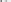
| **talea to prolatio quantization** (visualization) | 
| **quantized talea**                                | `[1]`
| **final result** (score)                           | 

| 0 < **quantization** &#8804; &#8531;               | totalValue = 1 <sub>(whole note)</sub>
| -------------------------------------------------- | -----
| **raw talea** (rescaled)                           | `[0.044,0.044,0.174,0.348,0.174,0.216]`
| **prolatio** depth = 1 (code)                      | `[2,4,1,1]`
| **prolatio** depth = 1 (score)                     | 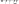
| **talea to prolatio quantization** (visualization) | 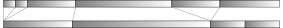
| **quantized talea**                                | `[0.25,0.5,0.25]`
| **final result** (score)                           | 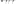

| &#8531; < **quantization** &#8804; &#8532;         | totalValue = 1 <sub>(whole note)</sub>
| -------------------------------------------------- | -----
| **raw talea** (rescaled)                           | `[0.044,0.044,0.174,0.348,0.174,0.216]`
| **prolatio** depth = 2 (code)                      | `[2,[1,1,1],4,1,[2,1,1],1,[2,1]]`
| **prolatio** depth = 2 (score)                     | 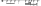
| **talea to prolatio quantization** (visualization) | 
| **quantized talea**                                | `[0.083, 0.167, 0.5, 0.062, 0.188]`
| **final result** (score)                           | 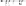

| &#8532; < **quantization** < 1                     | totalValue = 1 <sub>(whole note)</sub>
| -------------------------------------------------- | -----
| **raw talea** (rescaled)                           | `[0.044,0.044,0.174,0.348,0.174,0.216]`
| **prolatio** depth = 3 (code)                      | `[2,[1,[1,1],1,[1,1],1],4,1,[2,[3,1],1,1],1,[2,1]]`
| **prolatio** depth = 3 (score)                     | 
| **talea to prolatio quantization** (visualization) | 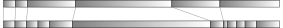
| **quantized talea**                                | `[0.042, 0.042, 0.168, 0.5, 0.048, 0.2]`
| **final result** (score)                           | 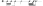

| **quantization** = 1                               | totalValue = 1 <sub>(whole note)</sub>
| -------------------------------------------------- | -----
| **raw talea** (rescaled)                           | `[0.044,0.044,0.174,0.348,0.174,0.216]`
| **prolatio**                                       | Prolatio is not needed because there is no quantization
| **talea to prolatio** (visualization)              | 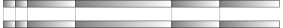
| **quantized talea** (no quantization is done)      | `[0.044,0.044,0.174,0.348,0.174,0.216]`
| **final result** (score)                           | 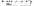

It is important to note that some of the rendered values could be rests. Rest are produced when event atributes as articulation or intensity are set to 0. 

The final result of a rhythmic grid is a sequence of floats. Consequently, a processed rhythmic grid can be a talea for a new grid.

--------
## Harmonic grid

A harmony can be expressed as a dictionary containing informations to be used by other functions to map pitches. These data is a representation of a group of pitches (usually a chord) and its interrelations with a pitch class set (usually a mode) and with the level of general chromatism. Using this information, certain functions adjust their values to the grid of pitches that fits this harmony and extract analytical information.

A **harmonic grid** is coded into an array following this data structure:

| index | feature          | data format          | description
| ----- | ---------------- | -------------------- | ----------- 
| 0     | **root**         | midipitchF           | main reference pitch (usually a chord's root)
| 1     | **chord**        | harmonyF             | pitch class sequence with the harmony pitches (regardless of tonal center)
| 2     | **mode**         | harmonyF             | pitch class sequence (usually, a scale) containing the chord pitches using C (pitch class 0) as root 
| 3     | **chromaticism** | float &isinv; [0, 1] | tolerance to chromatic notes (higher means more chromatic results)

---------
### root, chord and mode

The **root** note is used as origin to transpose the rest of harmonic parameters.

A **chord** is a set of notes that determine the leading harmony of a passage, while a **mode** is usually related to scales, and is a superset that contains the chord.

Note that chord and mode are not pitch class sets because order matters. The position within the pitch sequences determines the priority of each pitch for low degrees of chromaticism (the first, the most important). 

Root, chord and mode parameters can lead to very different results. Data types analog to harmonyF can be developed to create music with another tuning, microtonality or without equally-tempered intervals.

---------
### chromaticism

**chromaticism** is applied as a kind of pitch quantization. The raw pitch values of a melodic sequence is *rounded* to a series of pitch classes. The degree of chromaticism is denoted with a normalized value, which determines how complex is the sequence of eligible pitch classes.

This is the meaning of different values for chromaticism:

| chromaticism (*c*)        | result
| ----------------------- | ------
| 0 &#8804; *c* &#8804; 0.5 | only chord pitch classes are used, progressively incorporated as *c* is higher (0 &rarr; only 1 pitch class, 0.5 &rarr; all chord pitch classes)
| 0.5 < *c* &#8804; 0.8     | mode pitches classes are progressively integrated (0.500001 &rarr; only 1 new pitch class added, 0.8 &rarr; complete mode is employed)
| 0.8 < *c* &#8804; 1       | all remaining pitch classes of the chromatic scale are integrated

--------
### Example of harmonic motives

Given this harmonic grid:

```
{
    root: 0.68124,
    chord: [11,0,5,8,3],
    mode: [0,3,1,5,8,6,11,10],
    chromaticism: <float within interval [0, 1]>
}
```

The algorithm follows these steps:
1. Set the tonal center with **root**. The value `0.68124` correspond to the pitch A&#9837;, applying this [conversion](#midipitchf-m). 
2. Transpose pitch classes of **chord** and **mode** from C to G&#9839; (or A&#9837;) as root, keeping the same order: 

`[11,0,5,8,3]` &rarr; `[7,8,1,4,11]`:

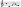 

`[0,3,1,5,8,6,11,10]` &rarr; `[8,11,9,1,4,2,7,6]`

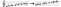 

3. Check the pitch classes of mode which are not part of chord and extract this ordered subsequence. In this case, the result is `[9,2,6]`. This set will be needed if higher chromaticism is employed.
4. Calculate the ranges of values corresponding to the increasing degrees of chromaticism, and transform input data accordingly.

The following tables show how increasing degrees of chromaticism affect to this grid, and the effect of applying it to a two-voices music excerpt (enharmonic differences are not relevant): 

| chromaticism (*c*) ranges of values | eligible pitch classes        | result
| ----------------------------------- | ----------------------------- | ----
| 0 &#8804; *c* < 0.1                 | `[7]` (monochordal)                         | 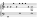 
| 0.1 &#8804; *c* < 0.2               | `[7,8]`                                     | 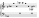
| 0.2 &#8804; *c* < 0.3               | `[7,8,1]`                                   | 
| 0.3 &#8804; *c* < 0.4               | `[7,8,1,4]`                                 | 
| 0.5 &#8804; *c* < 0.5               | `[7,8,1,4,11]` (complete chord)             | 
| 0.5 &#8804; *c* < 0.6               | `[7,8,1,4,11,9]`                            | 
| 0.6 &#8804; *c* < 0.7               | `[7,8,1,4,11,9,2]`                          | 
| 0.7 &#8804; *c* < 0.8               | `[7,8,1,4,11,9,2,6]` (complete mode)        | 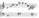
| 0.8 &#8804; *c* &#8804; 1           | `[0,1,2,3,4,5,6,7,8,9,10,11]` (all pitches) | 


---------
# Function libraries
A GenoMus Function Library is a JSON file that contains all available functions for genotype generation of a specific species.

## Function library data structure 

A GenoMus Function Library contains these blocks:
- **"metadata"**: 
  - **"species"**: name of the species.   
  - **"parametersStructure"**: basic event parameter structure. 
  - **"user"**: username
  - **"version"**: version number of the catalogue.
  - **"updated"**: date of last update.
  - ...
- **"outputType"**: all functions for genotype generation, grouped according to their output type.
- **"functionIndex"**: all functions for genotype generation, enumerated by their order of inclusion, along with their encoded function index.

## Indexing a function in a GenoMus Function Library
Functions are listed following this format:
```
"outputType": {
    "<functionType>": {
        "<functionName>": {
            "arguments": ["<functionType>", "<functionType>", ...],
            "description": "String describing what the function does.",
        "metadata": {
            "date": (date of creation, in compressed style),
            "creator": "<username>",
            ... (optional information if needed.)
        },
        ...
    },
    "<functionType>": {
    ...
}
```
The **description** and **metadata** fields are optional, but very helpful to understand quicky the processes in a genotype, and to add further informations and documentation about the function or the programmer.

Furthermore, each function must be included in the list of function index numbers:
```
"functionIndex": {
    "1": {
        "functionName": 0.618034
    },
    "2": {
        "functionName": 0.236068
    },
    ...
}
```
The integer index identifies the function. The float is the *encoded function index*. It is a number to map the function within the normalized interval [0, 1]. Encoded genotypes use this float to map all functions optimizing the maximal distance among functions into the interval. That's a critical issue for the automatic characterization of genotypes by machine learning techniques. 

Index numbers must correspond to only one function. To maintain the consistency of the library, an indexed function should not change its index numbers.

Index numbers of functions that use [human-readable leaf parameters](#human-readable-leaf-parameters) are assimilated to their standard equivalent functions with normalized parameters, and share the same index. Thus, encoded genotypes remain identical, regardless of whether human-readable conversions have been used. 

---------
## Encoded function index generation

Encoded function indexes are generated using a golden angle iteration mapped on the [0, 1] interval using this formula:


where *&#981;* is the golden ratio (&#8776; 1.618034), _**f<sub>e</sub>**_ is the index to identify the function in encoded genotypes and _**f<sub>d</sub>**_ is the correspondent decoded index, which is asigned incrementally in the catalogue. Encoded index numbers are rounded to have only six digits after the decimal point. Using this truncated format there are 514262 different indexes available until a recurrence occurs.

This map is used as the quantized function type **goldenintegerF** too [(more info)](#goldenintegerf-z).

From the *functionIndex* dictionary, an inverse dictionary is automatically created by rearranging the functions according to their ascending encoded index, following this format:

```
"encodedFunctionIndexes": {
    "0.236068": "functionNameX",
    "0.618034": "functionNameY",
    ...
}
```

This works as a useful lookup table for some automatic and manual processes.

---------
# Core functions
A GenoMus Function Library must include a collection of essential functions to perform basic operations for the generation of phenotypes. For each function type, the library has an identity function and other additional functions dedicated to the fundamental manipulations of that data category. As said before, lowercase prefixes indicate function types according to their output. 

This set of core functions are identified with the first index numbers of the library.

*This is still an incomplete list.*

---------
## Identity functions
An identity function simply pass its arguments without any musical transformation apart from formatting the output data accordingly when necessary. For each function type exists an identity function. 

For the sake of simplicity, identity functions are named using only their corresponding function type identifiers. They serve primarily as wrappers and testing functions.

Both function indexes, ordinal and encoded function index (smaller) are shown.
Highest function index so far: 327 (hRnd)

| function name | function type       | function index        | example decoded genotype &rarr; encoded phenotype
| ------------- | ------------------- | --------------------- | -------------------------------------------------
| `p`           | **paramF**          | 0 <sub>0</sub>        | `"p(.5)"` &rarr; `[0.5]` <sub>in progress</sub>
| `l`           | **listF**           | 1 <sub>.618034</sub>  | `"l(0,.3,1,.8)"` &rarr; `[0,0.3,1,0.8]` <sub>in progress</sub>
| `e`           | **eventF**          | 2 <sub>.236068</sub>  | `"e(p(.5),p(.4),p(0.6),p(.8))"` &rarr; `[0.5,0.618034,0.4,0.6,0.8]` <sub>in progress</sub>
| `v`           | **voiceF**          | 3 <sub>.854102</sub>  | `"v(e(p(.5),p(.4),p(0),p(.8)))"` &rarr; `[0,0.5,0.618034,0.4,0,0.8,1]` <sub>in progress</sub> 
| `s`           | **scoreF**          | 4 <sub>.472136</sub>  | `"s(v(e(p(.5),p(.4),p(0),p(.8))))"` &rarr; `[0,0,0.5,0.618034,0.4,0,0.8,1,1]` <sub>in progress</sub> 
| `n`           | **notevalueF**      | 5 <sub>.09017</sub>   | `"n(1/8)"` &rarr; `[0.5]` <sub>in progress</sub>
| `d`           | **durationF**       | 6 <sub>.708204</sub>  | `"d(1)"` &rarr; `[0.6]`
| `m`           | **midipitchF**      | 7 <sub>.326238</sub>  | `"m(60)"` &rarr; `[0.48]` <sub>in progress</sub>
| `f`           | **frequencyF**      | 8 <sub>.944272</sub>  | `"f(440)"` &rarr; `[0.385129]`
| `a`           | **articulationF**   | 9 <sub>.562306</sub>  | `"a(.5)"` &rarr; `[0.51729]` <sub>in progress</sub>
| `i`           | **intensityF**      | 10 <sub>.18034</sub>  | `"i(127)"` &rarr; `[1]` <sub>in progress</sub>
| `z`           | **goldenintegerF**  | 11 <sub>.798374</sub> | `"z(1)"` &rarr; `[0.618034]` <sub>in progress</sub>
| `q`           | **quantizedF**      | 12 <sub>.416408</sub> | `"q(-2)"` &rarr; `[0.4]` <sub>in progress</sub>
| `r`           | **rhythmF**         | 13 <sub>.034442</sub> | `"r([0,6,20,[2,1],16])"` &rarr; `[0,0.3,1,[1,0.5],0.8]`
| `h`           | **harmonyF**        | 14 <sub>.652476</sub> | `"h([0.03,0.02,0.69])"` &rarr; `[3,2,9]`
| `ln`          | **lnotevalueF**     | 15 <sub>.27051</sub>  | `"ln(1/8,1,1/2)"` &rarr; `[0.5,0.8,0.7]` <sub>in progress</sub>
| `ld`          | **ldurationF**      | 16 <sub>.888544</sub> | `"ld(8,1,2)"` &rarr; `[0.9,0.6,0.7]` <sub>in progress</sub>
| `lm`          | **lmidipitchF**     | 17 <sub>.506578</sub> | `"lm(70,69,71)"` &rarr; `[0.58,0.57,0.59]` <sub>in progress</sub>
| `lf`          | **lfrequencyF**     | 18 <sub>.124612</sub> | `"lf(162,32,4802)"` &rarr; `[0.3,0.2,0.7]` <sub>in progress</sub>
| `la`          | **larticulationF**  | 19 <sub>.742646</sub> | `"la(1,1,0.5)"` &rarr; `[0.667539,0.667539,0.51729]` <sub>in progress</sub>
| `li`          | **lintensityF**     | 20 <sub>.36068</sub>  | `"li(80,90)"` &rarr; `[0.629921,0.708402]` <sub>in progress</sub>
| `lz`          | **lgoldenintegerF** | 21 <sub>.978714</sub> | `"lz(10,8,6,3)"` &rarr; `[0.18034,0.944272,0.708204,0.854102]` <sub>in progress</sub>
| `lq`          | **lquantizedF**     | 22 <sub>.596748</sub> | `"lq(10,-10,0,-3,2)"` &rarr; `[0.79,0.21,0.5,0.36,0.6]` <sub>in progress</sub>
| `o`           | **operationF**      | 23 <sub>.214782</sub> | `"o(.5)"` &rarr; `[0.5]`
| `b`           | **booleanF**        | 24 <sub>.832816</sub> | `"b(.5)"` &rarr; `[1]`

---------
## List converters
| name    | index                    | description
| ------- | ------------------------ | -----------
| `lP2N`  | 319 <sub>.152842</sub>   | converts a normalized parameter list into a notevalue list
| `lP2D`  | 320 <sub>.770876</sub>   | converts a normalized parameter list into a duration list
| `lP2M`  | 321 <sub>.38891</sub>    | converts a normalized parameter list into a midipitch list
| `lP2F`  | 322 <sub>.006944</sub>   | converts a normalized parameter list into a frequency list
| `lP2A`  | 323 <sub>.624978</sub>   | converts a normalized parameter list into an articulation list
| `lP2I`  | 324 <sub>.243012</sub>   | converts a normalized parameter list into an intensity list

---------
## Internal autoreferences
| name        | index                               | description
| ----------- | ----------------------------------- | -----------
| `pAutoref`  | 25  <sub>.45085 in progress</sub>   | points to a previous parameter
| `lAutoref`  | 26  <sub>.068884 in progress</sub>  | points to a previous list
| `eAutoref`  | 27  <sub>.686918 in progress</sub>  | points to a previous event
| `vAutoref`  | 28  <sub>.304952 in progress</sub>  | points to a previous voice
| `sAutoref`  | 29  <sub>.922986 in progress</sub>  | points to a previous score
| `nAutoref`  | 277 <sub>.195415 in progress</sub>  | points to a previous notevalue parameter
| `dAutoref`  | 278 <sub>.813449 in progress</sub>  | points to a previous duration parameter
| `mAutoref`  | 279 <sub>.431483 in progress</sub>  | points to a previous midipitch parameter
| `fAutoref`  | 280 <sub>.049517 in progress</sub>  | points to a previous frequency parameter
| `aAutoref`  | 281 <sub>.667551 in progress</sub>  | points to a previous articulation parameter
| `iAutoref`  | 282 <sub>.285585 in progress</sub>  | points to a previous intensity parameter
| `gAutoref`  | 283 <sub>not yet implemented</sub>  | points to a previous golden integer parameter
| `qAutoref`  | 284 <sub>.521653 in progress</sub>  | points to a previous quantized parameter
| `oAutoref`  | 285 <sub>not yet implemented</sub>  | points to a previous operation parameter
| `lnAutoref` | 286 <sub>.757721 in progress</suv>  | points to a previous bla list
| `ldAutoref` | 287 <sub>.375755 in progress</suv>  | points to a previous bla list
| `lmAutoref` | 288 <sub>.993789 in progress</suv>  | points to a previous bla list
| `lfAutoref` | 289 <sub>.611823 in progress</suv>  | points to a previous bla list
| `laAutoref` | 290 <sub>.229857 in progress</suv>  | points to a previous bla list
| `liAutoref` | 291 <sub>.847891 in progress</suv>  | points to a previous bla list
| `lzAutoref` | 292 <sub>.465925 in progress</suv>  | points to a previous bla list
| `lqAutoref` | 293 <sub>.083959 in progress</suv>  | points to a previous bla list
| `pClone`    | 30  <sub>not yet implemented</sub>  | copy and paste a previous parameter branch without subsequent linking
| `lClone`    | 31  <sub>not yet implemented</sub>  | copy and paste a previous list branch without subsequent linking
| `eClone`    | 32  <sub>not yet implemented</sub>  | copy and paste a previous event branch without subsequent linking
| `vClone`    | 33  <sub>not yet implemented</sub>  | copy and paste a previous voice branch without subsequent linking
| `sClone`    | 34  <sub>not yet implemented</sub>  | copy and paste a previous score brach without subsequent linking
| `lIterP`    | 35  <sub>.63119 in progress</sub>   | repeats and concatenates as a list re-evaluations of a parameter function 
| `lIterL`    | 36  <sub>.249224 in progress</sub>  | repeats and concatenates as a list re-evaluations of a list function 
| `vIterE`    | 37  <sub>.867258 in progress</sub>  | repeats and concatenates as a voice re-evaluations of an event function 
| `vIterV`    | 38  <sub>not yet implemented</sub>  | repeats and concatenates as a voice re-evaluations of a voice function
| `sIterV`    | 39  <sub>not yet implemented</sub>  | repeats and overlays in a score re-evaluations of a voice function
| `sIterS`    | 40  <sub>not yet implemented</sub>  | repeats and concatenates as a score re-evaluations of a score function

---------
## External references
| name                   | index                              | description
| ---------------------- | ---------------------------------- | -----------
| `sGenotypeFromLibrary` | 275 <sub>not yet implemented</sub> | reads and inserts a genotype from an external library of genotypes
| `lTextfileData`        | 276 <sub>not yet implemented</sub> | reads and inserts a list of values from an external textfile

---------
## Form
| name        | index                              | description
| ----------- | ---------------------------------- | -----------
| `lConcatL`  | 41 <sub>.957428 in progress</sub>  | concatenates two lists sequentially
| `vConcatE`  | 42 <sub>.957428 in progress</sub>  | concatenates two events sequentially
| `vConcatV`  | 43 <sub>.575462 in progress</sub>  | concatenates two voices sequentially
| `sConcatS`  | 44 <sub>.193496 in progress</sub>  | concatenates two scores sequentially
| `eAddPitch` | 45 <sub>.811529 in progress</sub>  | adds a pitch to an event
| `vRepeatE`  | 46 <sub>.429563 in progress</sub>  | repeats an event a number of times
| `lRepeatL`  | 47 <sub>not yet implemented</sub>  | repeats a list a number of times
| `vRepeatV`  | 48 <sub>.665631 in progress</sub>  | repeats a voice a number of times
| `sRepeatS`  | 49 <sub>not yet implemented</sub>  | repeats a score a number of times
| `lAAp`      | 50 <sub>not yet implemented</sub>  | single repetition of a parameter
| `lAAl`      | 51 <sub>not yet implemented</sub>  | single repetition of a list
| `vAAe`      | 52 <sub>not yet implemented</sub>  | single repetition of an event
| `vAAv`      | 53 <sub>not yet implemented</sub>  | single repetition of a voice
| `sAA`       | 54 <sub>not yet implemented</sub>  | single repetition of a score
| `lABAp`     | 55 <sub>not yet implemented</sub>  | A-B-A structure of parameters
| `lABAl`     | 56 <sub>not yet implemented</sub>  | A-B-A structure of lists
| `vABAe`     | 57 <sub>not yet implemented</sub>  | A-B-A structure of events
| `vABAv`     | 58 <sub>not yet implemented</sub>  | A-B-A structure of voices
| `sABA`      | 59 <sub>not yet implemented</sub>  | A-B-A structure of events
| `lABCABp`   | 60 <sub>not yet implemented</sub>  | A-B-C-B-A structure of parameters
| `lABCABl`   | 61 <sub>not yet implemented</sub>  | A-B-C-B-A structure of lists
| `vABCABe`   | 62 <sub>not yet implemented</sub>  | A-B-C-B-A structure of events
| `vABCABv`   | 63 <sub>not yet implemented</sub>  | A-B-C-B-A structure of voices
| `sABCAB`    | 64 <sub>not yet implemented</sub>  | A-B-C-B-A structure of events
| `vSlice`    | 318 <sub>.534808 in progress</sub> | slices a part from the beginning or the end of a voice

---------
## Phrasing
| name                    | index                              | description
| ----------------------- | ---------------------------------- | -----------
| `vInterval`             | 198 <sub>not yet implemented</sub> | repeats previous note changing pitch according to an interval
| `vMotif`                | 199 <sub>.988764 in progress</sub> | creates a sequence of events based on lists
| `vMotifLoop`            | 200 <sub>.606798 in progress</sub> | creates a sequence of events based on repeating lists
| `vPerpetuumMobile`      | 201 <sub>.606798 in progress</sub> | creates a sequence of events based on repeating lists but with a single notevalue
| `vPerpetuumMobileLoop`  | 202 <sub>not yet implemented</sub> | creates a sequence of events based on lists but with a single notevalue
| `vAcciaccatura`         | 203 <sub>not yet implemented</sub> | adds an acciaccatura to an event
| `vAppoggiatura`         | 204 <sub>not yet implemented</sub> | adds an appoggiatura to an event
| `vTrill`                | 205 <sub>not yet implemented</sub> | converts an event in a trill of two pitches
| `vJitter`               | 206 <sub>not yet implemented</sub> | converts an event in a group of randomly alterning pitches
| `vGliss`                | 207 <sub>not yet implemented</sub> | connects two pitches with a scale (diatonic of chromatic)
| `sPedalNote`            | 208 <sub>not yet implemented</sub> | adds a new voice consisting of a single sustained note to a score  
| `vArpeggio`             | 209 <sub>not yet implemented</sub> | creates an arpeggio according to a harmonic grid
| `vProgression`          | 210 <sub>not yet implemented</sub> | creates a progression repeating a motif at a transposition interval with chormatic transposition
| `vDiatonic Progression` | 211 <sub>not yet implemented</sub> | creates a progression repeating a motif at a transposition interval adapting pitches to the harmonic grid
| `sEchoV`                | 212 <sub>not yet implemented</sub> | adds a new voice repeating a voice at a time interval

---------
## Poliphony
| name        | index                              | description
| ----------- | ---------------------------------- | -----------
| `e2Pitches` | 98  <sub>.567331 in progress</sub> | creates an event with two pitches
| `e3Pitches` | 99  <sub>.185365 in progress</sub> | creates an event with three pitches
| `e4Pitches` | 100 <sub>.803399 in progress</sub> | creates an event with four pitches
| `e5Pitches` | 101 <sub>.421433 in progress</sub> | creates an event with five pitches
| `e6Pitches` | 102 <sub>not yet implemented</sub> | creates an event with six pitches
| `eChord`    | 103 <sub>not yet implemented</sub> | creates an event with more than six pitches, with a maximal of 12 pitches
| `s2V`       | 104 <sub>.275535 in progress</sub> | creates an score with two simultaneous voices
| `s3V`       | 105 <sub>not yet implemented</sub> | creates an score with three simultaneous voices
| `s4V`       | 106 <sub>not yet implemented</sub> | creates an score with four simultaneous voices
| `s5V`       | 107 <sub>not yet implemented</sub> | creates an score with five simultaneous voices
| `s6V`       | 108 <sub>not yet implemented</sub> | creates an score with six simultaneous voices
| `sAddV`     | 109 <sub>.365705 in progress</sub> | adds a new voice vertically to a score
| `sAddS`     | 110 <sub>.983739 in progress</sub> | adds a new score vertically to a score

---------
## Counterpoint
| name                | index                              | description
| ------------------- | ---------------------------------- | -----------
| `s1stSpecies`       | 163 <sub>not yet implemented</sub> | creates a new voice oposing an event against each event of a previous voice
| `s2ndSpecies`       | 164 <sub>not yet implemented</sub> | creates a new voice oposing two events against each event of a previous voice
| `s2ndSpeciesInvert` | 165 <sub>not yet implemented</sub> | creates a new voice oposing an event against each two events of a previous voice
| `s3rdSpecies`       | 166 <sub>not yet implemented</sub> | creates a new voice oposing a fixed number of events (more than 2) against each event of a previous voice15
| `s3rdSpeciesInvert` | 167 <sub>not yet implemented</sub> | creates a new voice oposing an event against a fixed number of events (more than 2) of a previous voice15
| `s4thSpecies`       | 168 <sub>not yet implemented</sub> | creates a new voice oposing an event between each two events of a previous voice15
| `s5thSpecies`       | 169 <sub>not yet implemented</sub> | creates a new voice adding a new voice that combines freely the first four species

---------
## Harmony
| name                       | index                              | description
| -------------------------- | ---------------------------------- | -----------
| `vHarmonicGrid`            | 170 <sub>.065778 in progress</sub> | rewrites a voice according to a harmonic grid
| `sHarmonicGrid`            | 171 <sub>not yet implemented</sub> | rewrites a score according to a harmonic grid
| `hChromaticScale`          | 172 <sub>not yet implemented</sub> | returns a complete chromatic scale
| `hNaturalScale`            | 173 <sub>.91988 in progress</sub>  | returns modes derived from the natural scale
| `hMelodicMinorScale`       | 174 <sub>.537914 in progress</sub> | returns modes derived from the melodic minor scale
| `hPentatonicScale`         | 175 <sub>.155948 in progress</sub> | returns modes derived from the major pentatonic scale
| `hBluesScale`              | 176 <sub>.773982 in progress</sub> | returns a pentatonic scale with blue notes
| `hJapanesePentatonicScale` | 177 <sub>.392016 in progress</sub> | returns modes derived from japanese pentatonic scales
| `hHexatonicScale`          | 178 <sub>.01005 in progress</sub>  | returns a whole tone scale
| `hOctatonicScale`          | 179 <sub>.628084 in progress</sub> | returns a half-whole diminished scale 
| `hLimitedTranspoScale`     | 180 <sub>not yet implemented</sub> | returns modes of limited transposition
| `hPCSet`                   | 181 <sub>.864152 in progress</sub> | returns any mode generated by a list of pitches 
| `hCluster`                 | 182 <sub>not yet implemented</sub> | returns a group of consecutives chromatic tones
| `hOrientalizer`            | 183 <sub>not yet implemented</sub> | takes a mode and transforms it moving notes in the middle of two consecutives whole tones to get 3 half-tone intervals.
| `hBebopizer`               | 184 <sub>not yet implemented</sub> | takes a mode and returns it after inserting some chromatic steps
| `hDefectiveMode`           | 185 <sub>not yet implemented</sub> | takes a mode and returns it after deleting some pitches 
| `hMajorChord`              | 186 <sub>.954322 in progress</sub> | returns a major chord 
| `hMinorChord`              | 187 <sub>.572356 in progress</sub> | returns a minor chord 
| `hDominantChord`           | 188 <sub>not yet implemented</sub> | returns a dominant seventh chord
| `hSeventhChord`            | 189 <sub>not yet implemented</sub> | returns a four-note chord with triadic structure
| `hNinthChord`              | 190 <sub>not yet implemented</sub> | returns a five-note chord with triadic structure
| `hTwoPitchesChord`         | 191 <sub>not yet implemented</sub> | returns a pitch class sequence with two pitches 
| `hThreePCS`                | 192 <sub>not yet implemented</sub> | returns a pitch class sequence with three pitches
| `hFourPCS`                 | 193 <sub>not yet implemented</sub> | returns a pitch class sequence with four pitches
| `hFivePCS`                 | 194 <sub>not yet implemented</sub> | returns a pitch class sequence with five pitches
| `hSixPCS`                  | 195 <sub>not yet implemented</sub> | returns a pitch class sequence with six pitches
| `lExpandChord`             | 196 <sub>not yet implemented</sub> | takes a pitch class set and expands it across register, sometimes adding duplications
| `sHarmonizer`              | 197 <sub>not yet implemented</sub> | takes a voice and add a new one simultaneously, at an specified interval and according to the current harmonic grid 

---------
## Rhythm
| name                | index                              | description
| ------------------- | ---------------------------------- | -----------
| `vTempo`            | 154 <sub>not yet implemented</sub> | changes the relative tempo of a voice 
| `sTempo`            | 155 <sub>not yet implemented</sub> | changes the relative tempo of a score
| `vAccel`            | 156 <sub>not yet implemented</sub> | accelerates tempo along a voice
| `sAccel`            | 157 <sub>not yet implemented</sub> | accelerates tempo along a score
| `vRit`              | 158 <sub>not yet implemented</sub> | slows tempo along a voice
| `sRit`              | 159 <sub>not yet implemented</sub> | slows tempo along a score
| `vSimplifyRhythm`   | 160 <sub>not yet implemented</sub> | reduces the rhythmic complexity of a voice
| `sSimplifyRhythm`   | 161 <sub>not yet implemented</sub> | reduces the rhythmic complexity of a score
| `sIsorhythm`        | 162 <sub>not yet implemented</sub> | forces a isorhythmic texture for all voices within a score

---------
## Articulation
| name                    | index                              | description
| ----------------------- | ---------------------------------- | -----------
| `eMarcato`              | 238 <sub>not yet implemented</sub> | changes the articulation/dynamics of an event to marcato
| `vLegatissimo`          | 239 <sub>not yet implemented</sub> | changes all articulations within a voice to legatissimo
| `sLegatissimo`          | 240 <sub>not yet implemented</sub> | changes all articulations within a score to legatissimo
| `vNonLegato`            | 241 <sub>not yet implemented</sub> | changes all articulations within a voice to non-legato
| `sNonLegato`            | 242 <sub>not yet implemented</sub> | changes all articulations within a score to non-legato
| `vLegato`               | 243 <sub>not yet implemented</sub> | changes all articulations within a voice to legato
| `sLegato`               | 244 <sub>not yet implemented</sub> | changes all articulations within a score to legato
| `vStaccato`             | 245 <sub>not yet implemented</sub> | changes all articulations within a voice to staccato
| `sStaccato`             | 246 <sub>not yet implemented</sub> | changes all articulations within a score to staccato
| `vStaccatissimo`        | 247 <sub>not yet implemented</sub> | changes all articulations within a voice to staccatissimo
| `sStaccatissimo`        | 248 <sub>not yet implemented</sub> | changes all articulations within a score to staccatissimo
| `sPedalSustain`         | 249 <sub>not yet implemented</sub> | extends all articulations within a voice to simulate a pedal sustain
| `vShortenArticulations` | 250 <sub>not yet implemented</sub> | shortens all articulations within a voice according to a factor
| `vProlongArticulations` | 251 <sub>not yet implemented</sub> | extends all articulations within a voice according to a factor

---------
## Dynamics
| name         | index                              | description
| ------------ | ---------------------------------- | -----------
| `eSforzando` | 252 <sub>not yet implemented</sub> | changes the articulation/dynamics of an event to marcato
| `vCresc`     | 253 <sub>not yet implemented</sub> | creates a crescendo in a voice
| `sCresc`     | 254 <sub>not yet implemented</sub> | creates a crescendo in a score
| `vDim`       | 255 <sub>not yet implemented</sub> | creates a diminuendo in a voice
| `sDim`       | 256 <sub>not yet implemented</sub> | creates a diminuendo in a score
| `vLouder`    | 257 <sub>not yet implemented</sub> | increments the global dynamics of a voice
| `sLouder`    | 258 <sub>not yet implemented</sub> | increments the global dynamics of a score
| `vSofter`    | 259 <sub>not yet implemented</sub> | reduces the global dynamics of a voice
| `sSofter`    | 260 <sub>not yet implemented</sub> | reduces the global dynamics of a score
| `eMute`      | 261 <sub>not yet implemented</sub> | reduces to 0 the dynamics of an event

---------
## Spectralism
| name                | index                              | description
| ------------------- | ---------------------------------- | -----------
| `hHarmonicSeries`   | 262 <sub>.924905 in progress</sub> | returns a harmonic series as harmonic grid
| `hSpectralMorphing` | 263 <sub>not yet implemented</sub> | returns a harmonic series with some manipulations
| `vSpectralize`      | 264 <sub>not yet implemented</sub> | adjusts the pitches of a voice to a harmonic series
| `sSpectralize`      | 265 <sub>not yet implemented</sub> | adjusts the pitches of a score to a harmonic series

---------
## Serialism
| name                   | index                              | description
| ---------------------- | ---------------------------------- | -----------
| `hDodecaphonicToneRow` | 213 <sub>not yet implemented</sub> | returns a canonic dodecaphonic tone row
| `hUniquePitchesRow`    | 214 <sub>not yet implemented</sub> | returns a row of 2 to 11 pitches without repetitions
| `eInvert`              | 215 <sub>not yet implemented</sub> | inverts pitches of an event
| `vInvert`              | 216 <sub>not yet implemented</sub> | inverts pitches of a voice
| `sInvert`              | 217 <sub>not yet implemented</sub> | inverts pitches of a score
| `eTransp`              | 218 <sub>not yet implemented</sub> | transposes pitches of an event
| `vTransp`              | 219 <sub>not yet implemented</sub> | transposes pitches of a voice
| `sTransp`              | 220 <sub>not yet implemented</sub> | transposes pitches of a score
| `eTranspOctav`         | 221 <sub>not yet implemented</sub> | transposes pitches of an event only octaves
| `vTranspOctav`         | 222 <sub>not yet implemented</sub> | transposes pitches of a voice only octaves
| `sTranspOctav`         | 223 <sub>not yet implemented</sub> | transposes pitches of a score only octaves
| `vRetrog`              | 224 <sub>not yet implemented</sub> | retrogrades pitches of a voice
| `sRetrog`              | 225 <sub>not yet implemented</sub> | retrogrades pitches of a score
| `vRetrogInvert`        | 226 <sub>not yet implemented</sub> | retrogrades and inverts pitches of a voice
| `sRetrogInvert`        | 227 <sub>not yet implemented</sub> | retrogrades and inverts pitches of a score
| `eRotate`              | 228 <sub>not yet implemented</sub> | rotates pitches of an event according to its intervallic structure
| `eExpand`              | 229 <sub>not yet implemented</sub> | expands pitches of an event according to a factor
| `vExpand`              | 230 <sub>not yet implemented</sub> | expands pitches of a voice according to a factor
| `sExpand`              | 231 <sub>not yet implemented</sub> | expands pitches of a score according to a factor
| `vExtrude`             | 232 <sub>not yet implemented</sub> | deforms pitches of a voice according to a curve
| `sExtrude`             | 233 <sub>not yet implemented</sub> | deforms pitches of a score according to a curve
| `vReverse`             | 234 <sub>not yet implemented</sub> | reverses the order of a voice events
| `sReverse`             | 235 <sub>not yet implemented</sub> | reverses the order of a score events
| `vPalindrome`          | 236 <sub>not yet implemented</sub> | concatenates to a given voice all its events in reverse order
| `sPalindrome`          | 237 <sub>not yet implemented</sub> | concatenates to a given score all its events in reverse order

---------
## Aleatoric processes
| name               | index                              | description
| ------------------ | ---------------------------------- | -----------
| `pRnd`             | 131 <sub>.962453 in progress</sub> | returns a random normalized parameter with Gaussian (or normal) distribution
| `pUniformRnd`      | 132 <sub>.580487 in progress</sub> | returns a random normalized parameter with uniform distribution
| `pWrappedGaussRnd` | 133 <sub>not yet implemented</sub> | returns a random normalized parameter with a wrapped normal distribution
| `nRnd`             | 310 <sub>.590537 in progress</sub> | returns a random notevalue with with Gaussian (or normal) distribution
| `dRnd`             | 311 <sub>.208571 in progress</sub> | returns a random duration with with Gaussian (or normal) distribution
| `mRnd`             | 312 <sub>.826604 in progress</sub> | returns a random midipitch with with Gaussian (or normal) distribution
| `fRnd`             | 313 <sub>.444638 in progress</sub> | returns a random frequency with with Gaussian (or normal) distribution
| `aRnd`             | 314 <sub>.062672 in progress</sub> | returns a random articulation with with Gaussian (or normal) distribution
| `iRnd`             | 315 <sub>.680706 in progress</sub> | returns a random intensity with with Gaussian (or normal) distribution
| `zRnd`             | 316 <sub>.29874 in progress</sub>  | returns a random goldeninteger with with Gaussian (or normal) distribution
| `hRnd`             | 327 <sub>.097114 in progress</sub> | returns a random harmonic grid
| `qRnd`             | 317 <sub>.916774 in progress</sub> | returns a random quantized parameter with with Gaussian (or normal) distribution
| `lRnd`             | 134 <sub>.816554 in progress</sub> | returns a complete random list with with Gaussian distribution of parameters
| `lUniformRnd`      | 135 <sub>.434588 in progress</sub> | returns a complete random list with uniform distribution of values
| `lWrappedGaussRnd` | 136 <sub>not yet implemented</sub> | returns a complete random list with a wrapped normal distribution of values
| `eRnd`             | 137 <sub>not yet implemented</sub> | returns a complete random event with uniform distribution of parameters
| `eGaussRnd`        | 138 <sub>not yet implemented</sub> | returns a complete random event with with Gaussian distribution of parameters
| `eWrappedGaussRnd` | 139 <sub>not yet implemented</sub> | returns a complete random event with a wrapped normal distribution of parameters
| `vRnd`             | 140 <sub>not yet implemented</sub> | returns a complete random voice with uniform distribution of parameters
| `vGaussRnd`        | 141 <sub>not yet implemented</sub> | returns a complete random voice with with Gaussian distribution of parameters
| `vWrappedGaussRnd` | 142 <sub>not yet implemented</sub> | returns a complete random voice with a wrapped normal distribution of parameters
| `sRnd`             | 143 <sub>not yet implemented</sub> | returns a complete random score with uniform distribution of parameters
| `sGaussRnd`        | 144 <sub>not yet implemented</sub> | returns a complete random score with with Gaussian distribution of parameters
| `sWrappedGaussRnd` | 145 <sub>not yet implemented</sub> | returns a complete random score with a wrapped normal distribution of parameters
| `pRndRange`        | 146 <sub>not yet implemented</sub> | rescales a random normalized parameter to a new range
| `lRndDynamicRange` | 147 <sub>not yet implemented</sub> | rescales a list of random values a changing range
| `eMutate`          | 148 <sub>not yet implemented</sub> | changes parameters of an event according to probability and range of mutations
| `lMutate`          | 149 <sub>not yet implemented</sub> | changes values of a list according to probability and range of mutations
| `vMutate`          | 150 <sub>not yet implemented</sub> | changes parameters of a voice according to probability and range of mutations
| `sMutate`          | 151 <sub>not yet implemented</sub> | changes parameters of a score according to probability and range of mutations
| `lPermutate`       | 152 <sub>not yet implemented</sub> | permutates value positions of a list
| `vPermutate`       | 153 <sub>not yet implemented</sub> | permutates events positions of a voice
| `lJitter`          | 326 <sub>.47908 in progress </sub> | modifies randomly all values of a list according to a range

---------
## Algorithmic techniques
| name                 | index                              | description
| -------------------- | ---------------------------------- | -----------
| `lBrownian`          | 266 <sub>.397041 in progress</sub> | returns a list of values generated by a brownian movement
| `lMarkovChain`       | 267 <sub>not yet implemented</sub> | returns a list of values generated by a Markov chain
| `lTuringMachine`     | 268 <sub>not yet implemented</sub> | returns a list of values generated by a Turing machine
| `lLindenmayerSystem` | 269 <sub>not yet implemented</sub> | returns a list of values generated by a Lindenmayer system
| `lHilbertCurve`      | 270 <sub>not yet implemented</sub> | returns a list of values generated by a Hilbert curve
| `lCellularAutomata`  | 271 <sub>not yet implemented</sub> | returns a list of values generated by iterating an automaton
| `lFibonacci`         | 272 <sub>.105245 in progress</sub> | returns a Fibonacci sequence starting with two initial terms
| `lTribonacci`        | 325 <sub>.861046 in progress</sub> | returns a Tribonacci sequence starting with three initial terms
| `lRecursion`         | 273 <sub>not yet implemented</sub> | returns a sequence generated by a recursive formula
| `lLogisticMap`       | 274 <sub>.341313 in progress</sub> | returns a sequence generated with the logistic map
| `rEuclideanRhythm`   | 275 <sub>not yet implemented</sub> | returns an Euclidean rhythmic grid

---------
## List manipulation
| name                      | index                                  | description
| ------------------------- | -------------------------------------- | -----------
| `l2P`, `l3P`, ..., `l12P` | 65, 66, ..., 75 <sub>in progress</sub> | generates a list of x parameters
| `lRepeatP`                | 76 <sub>.970583 in progress</sub>      | repeats a parameter a number of times
| `lLine`                   | 77 <sub>.588617 in progress</sub>      | generates a straight progression between two values
| `lnLine`                  | 294 <sub>.701993 in progress</sub>     | generates a straight progression between two notevalue values
| `ldLine`                  | 295 <sub>.320027 in progress</sub>     | generates a straight progression between two duration values
| `lmLine`                  | 296 <sub>.938061 in progress</sub>     | generates a straight progression between two miditpitch values
| `lfLine`                  | 297 <sub>.556095 in progress</sub>     | generates a straight progression between two duration values
| `laLine`                  | 298 <sub>.174129 in progress</sub>     | generates a straight progression between two articulation values
| `liLine`                  | 299 <sub>.792163 in progress</sub>     | generates a straight progression between two intensity values
| `lzLine`                  | 300 <sub>.410197 in progress</sub>     | generates a straight progression between two goldeninteger values
| `lqLine`                  | 301 <sub>.028231 in progress</sub>     | generates a straight progression between two quantized values
| `lLinseg`                 | 78 <sub>not yet implemented</sub>      | generates a series of straight segments between several values
| `lExpon`                  | 79 <sub>not yet implemented</sub>      | generates an exponential progression between two values
| `lExpseg`                 | 80 <sub>not yet implemented</sub>      | generates a series of exponential progressions between several values
| `lOscil`                  | 81 <sub>not yet implemented</sub>      | generates a periodic sinusoidal oscillation between two values
| `lPhasor`                 | 82 <sub>not yet implemented</sub>      | generates periodic straight transitions from first value to second one
| `lTriangular`             | 83 <sub>not yet implemented</sub>      | generates periodic straight transitions from first value to second one and vice versa
| `lRemap`                  | 84 <sub>.914855 in progress</sub>      | remaps a list to a new range  
| `lnRemap  `               | 302 <sub>.646265 in progress</sub>     | remaps a notevalue list to a new range  
| `ldRemap  `               | 303 <sub>.264299 in progress</sub>     | remaps a duration list to a new range  
| `lmRemap  `               | 304 <sub>.882333 in progress</sub>     | remaps a midipitch list to a new range  
| `lfRemap  `               | 305 <sub>.500367 in progress</sub>     | remaps a frequency list to a new range  
| `laRemap  `               | 306 <sub>.118401 in progress</sub>     | remaps an articulation list to a new range  
| `liRemap  `               | 307 <sub>.736435 in progress</sub>     | remaps an intensity list to a new range  
| `lzRemap  `               | 308 <sub>.354469 in progress</sub>     | remaps a goldeninteger list to a new range  
| `lqRemap  `               | 309 <sub>.972503 in progress</sub>     | remaps a quantized list to a new range  
| `lSmooth`                 | 85 <sub>not yet implemented</sub>      | smooths distances between contiguous items in a list according to a factor
| `lRough`                  | 86 <sub>not yet implemented</sub>      | sharpens distances between contiguous items in a list according to a factor
| `lInvert`                 | 87 <sub>not yet implemented</sub>      | inverts values of a list
| `lTransp`                 | 88 <sub>not yet implemented</sub>      | transposes values of a list
| `lRetrog`                 | 89 <sub>not yet implemented</sub>      | retrogrades values of a list
| `lRetrogInvert`           | 90 <sub>not yet implemented</sub>      | retrogrades and inverts values of a list
| `lPalindrome`             | 91 <sub>not yet implemented</sub>      | concatenates to a list its values in reverse order
| `lRotate`                 | 92 <sub>not yet implemented</sub>      | rotates values of a list
| `lExpand`                 | 93 <sub>not yet implemented</sub>      | expands values of a list according to a factor
| `lExtrude`                | 94 <sub>not yet implemented</sub>      | deforms values of a list according to a curve
| `lPolynomicGesture`       | 95 <sub>not yet implemented</sub>      | generates a list by evaluating a polynomial
| `lBezierGesture`          | 96 <sub>not yet implemented</sub>      | generates a list based on a Bézier curve
| `lTrigonoGesture`         | 97 <sub>not yet implemented</sub>      | generates a list based on a trigonometric compound expression

---------
## Mathematical operations
 
| name       | index                              | description
| ---------- | ---------------------------------- | -----------
| `oSum`     | 111 <sub>.601773 in progress</sub> | returns the sum of two values
| `oDiff`    | 112 <sub>not yet implemented</sub> | returns the subtraction of two values
| `oMult`    | 113 <sub>not yet implemented</sub> | returns the multiplication of two values
| `oDiv`     | 114 <sub>not yet implemented</sub> | returns the quotient of two values
| `oMod`     | 115 <sub>not yet implemented</sub> | returns the modulo (the remainder of the first value divided by the second one)
| `oPow`     | 116 <sub>not yet implemented</sub> | returns an exponentiation using first value as base and second as exponent 
| `oLog`     | 117 <sub>not yet implemented</sub> | returns the logarithm to base second value of the first value
| `oAbs`     | 118 <sub>not yet implemented</sub> | returns the absolute value of the input
| `oFract`   | 119 <sub>not yet implemented</sub> | returns the fractional value of the input
| `oFloor`   | 120 <sub>not yet implemented</sub> | returns the greates integer less or equal to the input
| `oCeil`    | 121 <sub>not yet implemented</sub> | returns the least integer greater or equal to the input
| `oSin`     | 122 <sub>not yet implemented</sub> | returns the sine of a value
| `oCos`     | 123 <sub>not yet implemented</sub> | returns the cosine of a value
| `oTan`     | 124 <sub>not yet implemented</sub> | returns the tangent of a value
| `oArcsin`  | 125 <sub>not yet implemented</sub> | returns the arcsine of a value
| `oArccos`  | 126 <sub>not yet implemented</sub> | returns the arccosine of a value
| `oArctan`  | 127 <sub>not yet implemented</sub> | returns the arctangent of a value
| `oSinh`    | 128 <sub>not yet implemented</sub> | returns the hyperbolic sine of a value
| `oCosh`    | 129 <sub>not yet implemented</sub> | returns the hyperbolic cosine of a value
| `oTanh`    | 130 <sub>not yet implemented</sub> | returns the hyperbolic tangent of a value

---------
## Manual operators of genotypes 
| name       | index                          | description
| ---------- | ------------------------------ | -----------
| `uEVOLVE`  | <sub>not yet implemented</sub> | forces that all processes of evolution and mutation affects only the branch in which the function is inserted
| `uFREEZE`  | <sub>not yet implemented</sub> | blocks a genotype branch to exclude it from all processes of evolution and mutation 
| `uFLATTEN` | <sub>not yet implemented</sub> | renders a genotype branch and replace the branch with the encoded phenotype, so it will be not changed or evaluated anymore 
| `uEXTRACT` | <sub>not yet implemented</sub> | set boundaries on a score to allow transformations in only that part regardless of the score functional structure
| `uCUT`     | <sub>not yet implemented</sub> | set boundaries on a score and delete all events outside that section
| `uSAVE`    | <sub>not yet implemented</sub> | saves a genotype branch to an external library

---------
# Encoding-decoding genotypes

An encoded genotype is an unidimensional array of normalized values &isinv; [0, 1]. This encoded form is intended to be a pure numeric equivalent to the decoded genotype. The purpose of encoding is to provide an abstract representation of compositional procedures, suitable for different machine learning techniques such as evolutionary algorithms or neural networks.

---------
## Conversion table for genotypes

|  type               | identifier    | value                  | example encoded &#x21C6; decoded 
| ------------------- | ------------- | ---------------------- | ------------------------------------
| `)` or `),`         | 0             | -                      | `[0]` &#x21C6; `"), "`
| voidLeaf            | no identifier | -                      | - 
| leaf                | 0.5           | parameter              | `[0.5, 0.3]` &#x21C6; `"0.3, "` 
| notevalueLeaf       | 0.51          | normalized parameter   | `[0.51, 0.3]` &#x21C6; `"1/32, "` 
| durationLeaf        | 0.52          | normalized parameter   | `[0.52, 0.3]` &#x21C6; `"0.125, "` 
| midipitchLeaf       | 0.53          | normalized parameter   | `[0.53, 0.3]` &#x21C6; `"42, "` 
| frequencyLeaf       | 0.54          | normalized parameter   | `[0.54, 0.3]` &#x21C6; `"162, "` 
| articulationLeaf    | 0.55          | normalized parameter   | `[0.55, 0.3]` &#x21C6; `"0.113708, "` 
| intensityLeaf       | 0.56          | normalized parameter   | `[0.56, 0.3]` &#x21C6; `"38.1, "` 
| goldenintegerLeaf   | 0.57          | normalized parameter   | `[0.57, 0.3]` &#x21C6; `"514262, "` 
| quantizedLeaf       | 0.58          | normalized parameter   | `[0.58, 0.3]` &#x21C6; `"-6, "` 
| booleanLeaf         | 0.59          | normalized parameter   | `[0.59, 0.3]` &#x21C6; `"0, "` 
| operationLeaf       | 0.6           | normalized parameter   | `[0.6, 0.56]` &#x21C6; (unnecessary?) 
| *newtypeLeaf*       | 0.6 < *x* < 1 | normalized parameter   | `[x, 0.3]` &#x21C6; human-readable converted value 
| function name + `(` | 1             | encoded function index | `[1, 0.304952]` &#x21C6; `"vMotif("`

For each new function type, its identifier must be in interval (0.6, 1) and unique. 

----------
## Formatting decoded genotypes

 *IMPORTANT: All following examples must be updated: parameter list are now between parenthesis instead of square brackets.*


Given the decoded expression 

`"funcNameA(0.3, funcNameB([0.1, 0.2, [0, 1], 0.3]), 0.2)"`, 

if the encoded function index of **funcNameA** and **funcNameB** were 0.123 and 0.456, the encoding process write 

`[1, 0.123, 0.5, 0.3, 1, 0.456, 0.8, 0.5, 0.1, 0.5, 0.2, 0.8, 0.5, 0, 0.5, 1, 0.2, 0, 0.5, 0.2, 0]`. 

Redecoding directly this last array produce

`"funcNameA(0.3,funcNameB([0.1,0.2,[0,1,],0.3,],),0.2,),"`.

Trailing commas after last element in enumerations and after closing parenthesis and brackets are removed when decoding encoded genotypes, resulting in:

`"funcNameA(0.3,funcNameB([0.1,0.2,[0,1],0.3]),0.2)"`.

When displaying decoded genotypes, further transformations are made to get better readability and editability:

```
"
funcNameA(
   0.3,
   funcNameB(
      [0.1, 0.2, [0, 1], 0.3]
   ),
   0.2,
)
"
```

---------
# Encoding-decoding phenotypes

A phenotype contains the music excerpt generated by a genotype in a similar way to the MIDI standard: it is list of events that can be transformed into a music score, or processed as audio with virtual instruments.

The format of an encoded phenotype is formally identical to an encoded genotype: both are a sequence of normalized floats whithin interval [0, 1]. As a consequence, encoded genotypes and phenotypes can be seen mathematically as the same type of object: n-dimensional vectors of real numbers within the interval [0, 1]. Furthermore, the evaluation of genotypes can be understood as a map that relates musical procedures to musical scores. This map is non-injective: different genotypes can generate the same phenotype, since diverse compositional processes can lead to the same result. At the same time, if the phenotype seed is changed, a genotype can generate many different phenotypes.

---------
## Encoded phenotype structure

| structure      | encoding
| -------------- | --------
| score          | `[1, <encodedVoice1>, <encodedVoice2>, ..., <encodedVoiceN, 0]`
| voice          | `[1, <encodedEvent1>, <encodedEvent2>, ..., <encodedEventN, 0]`
| event          | `[<eventParameter1>, <eventParameter2>, ...<eventParameterN>]` 
| multiparameter | `[<totalValues>, <value1>, <value2>, ..., <valueN>]`

- All phenotypes have the same hierarchical structure: events within a voice, and voices within a score. 
- Event data is listed as normalized values. Voices and scores are notated using numbers as flags: `1` and `0` indicate beginnings and endings of these wrappers.
- A score can consist of several concatenated scores (especially when their number of voices is different). For this reason it is necessary to use flags to connect them.
- The event data structure is predetermined by the [species characterization](#species-characterization).
- All event values are normalized according to predefined [parameter maps](#parameter-mapping). 
- If an event parameter uses more than one value, it is called *multiparameter*. The first float indicates the number of values needed (normalized as a [golden integer](#goldenintegerf-z)) followed by the values. 


---------
## Decoded phenotype

A decoded phenotype is any translation of an encoded phenotype readable for other software. Common formats for writing decoded phenotypes can be standard MIDI, MusicXML, Lilypond, readable messages for *bach.roll* and *bach.score* objects in Max, Csound, etc.


---------
# Examples of specimens

The following minimal examples illustrate several cases of conversion among encoded/decoded genotypes/phenotypes.

Decoded genotypes are automatically formatted for better readability and editability. They are equivalent to a compressed script without line breaks or tabs.  

All these examples belong to the default *piano* species. Phenotypes have been decoded into Lilypond language, but only the graphical rendering of this code is shown. 

---------
## Minimal specimen
#### Decoded genotype
##### Formatted
```
"
s(
   v(
      e(
         p(0.5),
         p(0.5),
         p(0.5),
         p(0.5)
      )
   ) 
)
"
```

##### Compressed
`"s(v(e(p(.5),p(.5),p(.5),p(.5))))"`

#### Encoded genotype
`[1, 0.472136, 1, 0.854102, 1, 0.236068, 1, 0, 0.5, 0.5, 0, 1, 0, 0.5, 0.5, 0, 1, 0, 0.5, 0.5, 0, 1, 0, 0.5, 0.5, 0, 0, 0, 0]`

#### Encoded phenotype
`[1, 1, 0.5, 0.618034, 0.5, 0.5, 0.5, 0, 0]`

#### Visualization of encoded genotype to encoded phenotype mapping

<sub>Visualizations map normalized values to grayscale (0=white, 1=black).</sub>

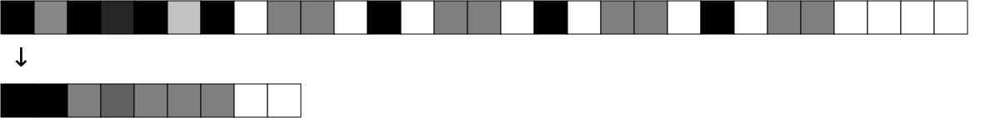

#### Decoded phenotype

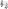

---------
## Minimal specimen with human-readable leaf parameters

This table shows the encoding/decoding of lexical tokens in this example:

| decoded  | encoded
| -------- | -------
| `"s("`   | `[1, 0.472136]`
| `"v("`   | `[1, 0.854102]`
| `"e("`   | `[1, 0.236068]`
| `"n("`   | `[1, 0.09017]`
| `"1/16"` | `[0.51, 0.4]`
| `")"`    | `[0]`
| `"),"`   | `[0]`
| `"m("`   | `[1, 0.326238]`
| `"69"`   | `[0.53, 0.57]`
| `"a("`   | `[1, 0.562306]`
| `"0.4"`  | `[0.55, 0.248547]`
| `"i("`   | `[1, 0.18034]`
| `"80"`   | `[0.56, 0.629921]`

#### Decoded genotype
##### Formatted
```
"
s(
   v(
      e(
         n(1/16),
         m(69),
         a(0.4),
         i(80)
      )
   )   
)
"
```

##### Compressed
`"s(v(e(n(1/16),m(69),a(0.4),i(80))))"`

#### Encoded genotype
`[1, 0.472136, 1, 0.854102, 1, 0.236068, 1, 0.09017, 0.51, 0.4, 0, 1, 0.326238, 0.53, 0.57, 0, 1, 0.562306, 0.55, 0.476522, 0, 1, 0.18034, 0.56, 0.629921, 0, 0, 0, 0]`

#### Encoded phenotype
`[1, 1, 0.4, 0.618034, 0.57, 0.476522, 0.629921, 0, 0]`

#### Visualization

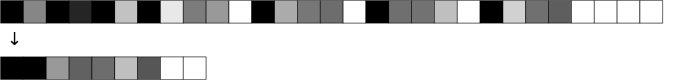

#### Decoded phenotype

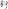

---------
## Voice with lists

This example uses the function `vMotifLoop`<sub>.304952</sub> (as subscript, its encoded function number). This function which creates a sequence of events based on lists. The longest list determines how many events are rendered. Shorter lists are used as loops until the longest list length is reached.

The two lists in this genotype have been encoded as follows:

| decoded           | encoded
| ------------------| -------
| `"[1/2,1/4]"`     | `[0.8, 0.51, 0.7, 0.51, 0.6, 0.2]`
| `"[63,67,63,58]"` | `[0.8, 0.53, 0.51, 0.53, 0.55, 0.53, 0.51, 0.53, 0.46, 0.2]`

#### Decoded genotype
##### Formatted
```
"
s(
   vMotifLoop(
      ln([1/2,1/4]),
      lm([63,67,63,58]),
      a(1),
      i(42)
   )
)
"
```

##### Compressed
`"s(vMotifLoop(ln([1/2,1/4]),lm([63,67,63,58]),a(1),i(42)))"`

#### Encoded genotype
`[1, 0.472136, 1, 0.304952, 1, 0.27051, 0.8, 0.51, 0.7, 0.51, 0.6, 0.2, 0, 1, 0.506578, 0.8, 0.53, 0.51, 0.53, 0.55, 0.53, 0.51, 0.53, 0.46, 0.2, 0, 1, 0.562306, 0.55, 0.667539, 0, 1, 0.18034, 0.56, 0,330709, 0, 0, 0]` 

#### Encoded phenotype

`[1, 1, 0.7 ,0.618034, 0.51, 0.667539, 0.330709, 0.6 ,0.618034, 0.55, 0.667539, 0.330709, 0.7 ,0.618034, 0.51, 0.667539, 0.330709, 0.6 ,0.618034, 0.47, 0.667539, 0.330709, 0, 0]`

#### Visualization

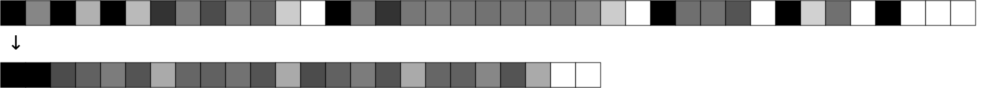

#### Decoded phenotype
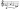

--------
## Multiple voices and multiple scores

The following example demostrate these concepts:

- A score can be made of many scores (only) sequentially concatenated.
- Poliphony is created adding voices vertically inside a score.

This example uses these functions:

- `sConcatS`<sub>.54102</sub>, which concatenates two scores sequentially.
- `sAddV`<sub>.159054</sub>, which adds a new voice vertically to a score.
- `vRepeatE`<sub>.777088</sub>, which repeats an event a number of times.

#### Decoded genotype
##### Formatted
```
"
sConcatS(    
   sAddV(
      sAddV(
         s(
            vRepeatE(
                e(
                  n(1/16),
                  lm([68,74,77]),
                  a(.2),
                  i(25)
                ),
                z(24)
            )
         ),
         vRepeatE(
            e(
               n(1/12),
               lm([62,65]),
               a(.2),
               i(15)
            ),
            z(18)
         )
      ),
      vMotifLoop(
         ln([1/2,1/4]),
         lm([53,56,53,46]),
         a(1),
         i(64)
      )
   ),
   sAddV(
      s(
         vMotifLoop(
            ln([1/2,1/4]),
            lm([63,67,63,58]),
            a(1),
            i(42)
         )
      ),
      vRepeatE(
         e(
            n(1/8),
            m(51),
            a(0.5),
            i(32)
         ),
         z(12)    
      )         
   ) 
)
"
```

##### Compressed
`"sConcatS(sAddV(sAddV(s(vRepeatE(e(n(1/16),lm([68,74,77]),a(.2),i(25)),z(24))),vRepeatE(e(n(1/12),lm([62,65]),a(.2),i(15)),z(18))),vMotifLoop(ln([1/2,1/4]),lm([53,56,53,46]),a(1),i(64))),sAddV(s(vMotifLoop(ln([1/2,1/4]),lm([63,67,63,58]),a(1),i(42))),vRepeatE(e(n(1/8),m(51),a(0.5),i(32)),z(12))))"`

#### Encoded genotype
`[1, 0.54102, 1, 0.159054, 1, 0.159054, 1, 0.472136, 1, 0.777088, 1, 0.236068, 1, 0.09017, 0.51, 0.4, 0, 1,  0.506578, 0.8, 0.53, 0.56, 0.53, 0.62, 0.53, 0.65, 0.2, 0, 1, 0.562306, 0.55, 0.369267, 0, 1, 0.18034, 0.56, 0.19685, 0, 0, 1, 0.798374, 0.57, 0.832816, 0, 0, 0, 1, 0.777088, 1, 0.236068, 1, 0.09017, 0.51, 0.441504, 0, 1,  0.506578, 0.8, 0.53, 0.5, 0.53, 0.53, 0.2, 0, 1, 0.562306, 0.55, 0.369267, 0, 1, 0.18034, 0.56, 0.11811, 0, 0, 1, 0.798374, 0.57, 0.124612, 0, 0, 0, 1, 0.304952, 1, 0.27051, 1, 0.8, 0.51, 0.7, 0.51, 0.61, 0.2, 0, 1,  0.506578, 0.8, 0.53, 0.41, 0.53, 0.44, 0.53, 0.41, 0.53, 0.34, 0.2, 0, 1, 0.562306, 0.55, 0.667539, 0, 1, 0.18034, 0.56, 0.503937, 0, 0, 0, 1, 0.159054, 1, 0.472136, 1, 0.304952, 1, 0.27051, 1, 0.8, 0.51, 0.7, 0.51, 0.61, 0.2, 0, 1,  0.506578, 0.8, 0.53, 0.51, 0.53, 0.55, 0.53, 0.51, 0.53, 0.461, 0.2, 0, 1, 0.562306, 0.55, 0.667539, 0, 1, 0.18034, 0.56, 0.330709, 0, 0, 0, 1, 0.777088, 1, 0.236068, 1, 0.09017, 0.51, 0.5, 0, 1, 0.326238, 0.53, 0.38, 0, 1, 0.562306, 0.55, 0.51729, 0, 1, 0.18034, 0.56, 0.251969, 0, 0, 1, 0.798374, 0.57, 0.416408, 0, 0, 0, 0]` 

#### Encoded phenotype

`[1, 1, 0.4, 0.854102, 0.56, 0.62, 0.65, 0.369267, 0.19685, 0.4, 0.854102, 0.56, 0.62, 0.65, 0.369267, 0.19685, 0.4, 0.854102, 0.56, 0.62, 0.65, 0.369267, 0.19685, 0.4, 0.854102, 0.56, 0.62, 0.65, 0.369267, 0.19685, 0.4, 0.854102, 0.56, 0.62, 0.65, 0.369267, 0.19685, 0.4, 0.854102, 0.56, 0.62, 0.65, 0.369267, 0.19685, 0.4, 0.854102, 0.56, 0.62, 0.65, 0.369267, 0.19685, 0.4, 0.854102, 0.56, 0.62, 0.65, 0.369267, 0.19685, 0.4, 0.854102, 0.56, 0.62, 0.65, 0.369267, 0.19685, 0.4, 0.854102, 0.56, 0.62, 0.65, 0.369267, 0.19685, 0.4, 0.854102, 0.56, 0.62, 0.65, 0.369267, 0.19685, 0.4, 0.854102, 0.56, 0.62, 0.65, 0.369267, 0.19685, 0.4, 0.854102, 0.56, 0.62, 0.65, 0.369267, 0.19685, 0.4, 0.854102, 0.56, 0.62, 0.65, 0.369267, 0.19685, 0.4, 0.854102, 0.56, 0.62, 0.65, 0.369267, 0.19685, 0.4, 0.854102, 0.56, 0.62, 0.65, 0.369267, 0.19685, 0.4, 0.854102, 0.56, 0.62, 0.65, 0.369267, 0.19685, 0.4, 0.854102, 0.56, 0.62, 0.65, 0.369267, 0.19685, 0.4, 0.854102, 0.56, 0.62, 0.65, 0.369267, 0.19685, 0.4, 0.854102, 0.56, 0.62, 0.65, 0.369267, 0.19685, 0.4, 0.854102, 0.56, 0.62, 0.65, 0.369267, 0.19685, 0.4, 0.854102, 0.56, 0.62, 0.65, 0.369267, 0.19685, 0.4, 0.854102, 0.56, 0.62, 0.65, 0.369267, 0.19685, 0.4, 0.854102, 0.56, 0.62, 0.65, 0.369267, 0.19685, 0, 1, 0.441504, 0.124612, 0.5, 0.53, 0.369267, 0.11811, 0.441504, 0.124612, 0.5, 0.53, 0.369267, 0.11811, 0.441504, 0.124612, 0.5, 0.53, 0.369267, 0.11811, 0.441504, 0.124612, 0.5, 0.53, 0.369267, 0.11811, 0.441504, 0.124612, 0.5, 0.53, 0.369267, 0.11811, 0.441504, 0.124612, 0.5, 0.53, 0.369267, 0.11811, 0.441504, 0.124612, 0.5, 0.53, 0.369267, 0.11811, 0.441504, 0.124612, 0.5, 0.53, 0.369267, 0.11811, 0.441504, 0.124612, 0.5, 0.53, 0.369267, 0.11811, 0.441504, 0.124612, 0.5, 0.53, 0.369267, 0.11811, 0.441504, 0.124612, 0.5, 0.53, 0.369267, 0.11811, 0.441504, 0.124612, 0.5, 0.53, 0.369267, 0.11811, 0, 1, 0.7, 0.618034, 0.41, 0.667539, 0.503937, 0.6, 0.618034, 0.44, 0.667539, 0.503937, 0.7, 0.618034, 0.41, 0.667539, 0.503937, 0.6, 0.618034, 0.34, 0.667539, 0.503937, 0, 0, 1, 1, 0.7, 0.618034, 0.51, 0.667539, 0.330709, 0.6, 0.618034, 0.55, 0.667539, 0.330709, 0.7, 0.618034, 0.51, 0.667539, 0.330709, 0.6, 0.618034, 0.46, 0.667539, 0.330709, 0, 1, 0.5, 0.618034, 0.38, 0.51729, 0.251969, 0.5, 0.618034, 0.38, 0.51729, 0.251969, 0.5, 0.618034, 0.38, 0.51729, 0.251969, 0.5, 0.618034, 0.38, 0.51729, 0.251969, 0.5, 0.618034, 0.38, 0.51729, 0.251969, 0.5, 0.618034, 0.38, 0.51729, 0.251969, 0.5, 0.618034, 0.38, 0.51729, 0.251969, 0.5, 0.618034, 0.38, 0.51729, 0.251969, 0.5, 0.618034, 0.38, 0.51729, 0.251969, 0.5, 0.618034, 0.38, 0.51729, 0.251969, 0.5, 0.618034, 0.38, 0.51729, 0.251969, 0.5, 0.618034, 0.38, 0.51729, 0.251969, 0, 0]`

#### Visualization

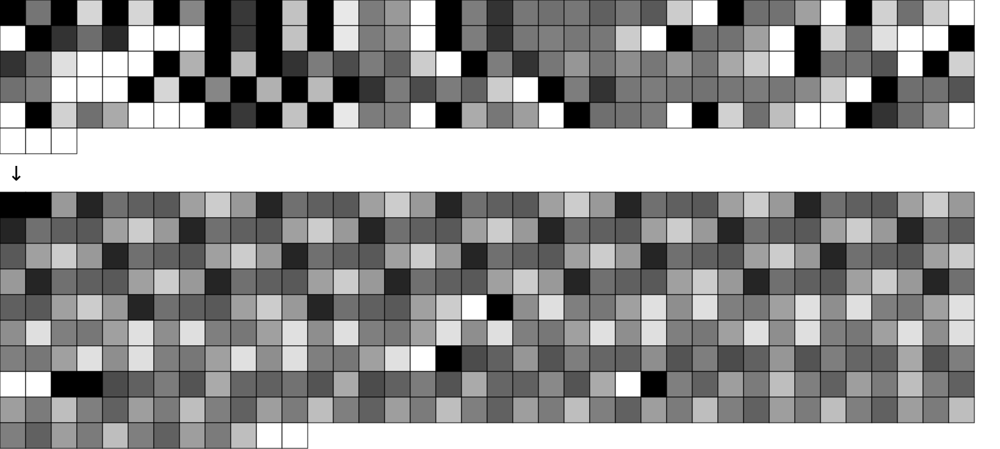

#### Decoded phenotype
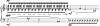

---------
# Genotype substructures
## Branches and leaves

A genotype functional tree can be divided into branches and leaves:

- The genotype **branches** network is the function tree without leaves. This can be understood as the pure structure of compositional procedures regardless of the specific values of arguments. 
- The set of **leaves** is the complementary information to the branches network: a list of every leaf value with a pointer to its position inside a genotype.  

Starting with this genotype, taken from [this example](#minimal-specimen-with-human-readable-leaf-parameters), 

`"s(v(e(n(1/16),m(69),a(0.4),i(80))))"`,

whose encoded equivalent is

`[1, 0.472136, 1, 0.854102, 1, 0.236068, 1, 0.09017, 0.51, 0.4, 0, 1, 0.326238, 0.53, 0.57, 0, 1, 0.562306, 0.55, 0.248547, 0, 1, 0.18034, 0.56, 0.629921, 0, 0, 0, 0]`,

is possible to extract an array of arrays with positions and values of leaves:

`[[9, 0.4],[14, 0.57],[19, 0.248547],[24, 0.629921]]`

Since all encoded leafs are normalized values, it is easy explore transformations of a genotype by manipulating them homogeneously, without distinguishing the type of parameter they represent, and injecting them back changing the corresponding positions of the encoded genotype.


---------
# Generation, evolution and selection of specimens
## Initial conditions for generation of genotypes

This table lists all information required for the process of generation, evaluation and selection of specimens. The default values can be modulated from the user interface. 

| initial condition      | description                                                                          | default value
| ---------------------- | ------------------------------------------------------------------------------------ | -------------
| **species**            | name of the species that determines event structure and functions library            | `"piano"`
| **function library**   | name of the JSON file containing all the available functions for genotype generation | last version of library for the *piano* species
| **includedFunctions**  | set of functions that can be chosen                                                  | `[]` &rarr; all available functions are elegible
| **excludedFunctions**  | set of functions excluded                                                            | `[]` &rarr; no function excluded
| **mandatoryFunctions** | set of compulsory functions that must appear in new genotypes                        | `[]` &rarr; no mandatory functions
| **elegibleFunction**   | set of elegible functions generated automatically from previous sets                 | array containing a complete list of the available functions in the library
| **requestedProfile**   | weighted vector of desired musical characteristics                                   | `0.5` for items, `0` for weights (no profile defined)
| **genMaxLength**       | deepest level of ramification for new genotypes                                      | `8`
| **phenMinLength**      | minimal number of events whithin the resulting phenotype                             | `1`
| **phenMaxLength**      | maximal number of events whithin the resulting phenotype                             | `1000`
| **maxIterations**      | maximal number of attempts to get a specimen that meets the requirements             | `500`


---------
## Species characterization

The concept of species is crucial, because each species is determined by the parameter structure of a basic sonic event, and the functional arquitecture depends on this characterization. Specimens belonging to different species cannot be mixed without some kind of ad hoc adaptation. Consequently, an independent library must be created for each new species.

A species characterization must determine which mapping is employed for the decoding of each parameter. 

The default species of GenoMus, called *piano*, uses this event parameter structure:

`[<notevalueF>, <n>, <midipitchF_1>, <midipitchF_2>, ..., <midipitch_n>, <articulationF>, <intensityF>]`

The second parameter is a **midipitchF** *multiparameter*, which begins with _**n**_ as the total number of midipitch values (written as an encoded golden integer) followed by the series of values.

For each parameter, decoded phenotypes use the [conversion rules](#parameter-mapping) of the invoked function types.

---------
## Eligible functions

**includedFunctions**, **excludedFunctions** and **mandatoryFunctions** variables determine which functions from the library are eligible for the generation of new genotypes.

Note that in the case of **includedFunctions** an empty array means that all functions of the library are eligible.

To improve readability, the numbers used to indicate functions in these arrays are their corresponding golden integer indexes.

Using these three arrays, a new array called **eligibleFunctions** is automatically constructed, to have an ordered enumeration of all available functions at the precise moment of a genotype generation. 

For instance, given this variables setup:

```
var includedFunctions = [];
var excludedFunctions = [23,35];
var mandatoryFunctions = [62,35,25];
```

- First, all available functions are included by default because **includedFunctions** is an empty array.
- **excludedFunctions** will remove functions with indexes 23 and 35 from the list.
- Finally, functions with indexes 62, 35 and 25 are declared as mandatory (overwriting the removal of **excludedFunctions** for index 35). 

So, for the generation of genotypes all functions are eligible except 23; functions 62, 35 and 25 must be obligatorily used. This complete list of available function indexes will be automatically stored in the variable **eligibleFunctions**.

-----------
## Specimen autoanalytic profile

Each specimen stores an autoanalysis of a set of musical characteristics. Each feature is asigned a normalized value. A higher value means more musical complexity:

| feature tag                   | metrics 
| ----------------------------- | -------   
| **"autoreference"**           | 0 &rarr; no autoreferences<br>0.5 &rarr; 50% of functions are autoreferences<br>1 &rarr; all functions are autoreferences
| **"variability"**             | 0 &rarr; all events are repetitions or previous events (one event repeated as the only texture)<br>0.5 &rarr; 50% or events involve repetition of previous patterns<br>1 &rarr; there is no repetitions at all
| **"rhythmDensity"**           | 0 &rarr; average separation between events is more than 20 seconds<br>0.5 &rarr; average separation between events is 1 second<br>1 &rarr; average separation between events is less than 0.05 seconds
| **"rhythmComplexity"**        | 0 &rarr; a single rhythmic value<br>0.5 &rarr; many different rhythmic values, but easy to distinguish patterns<br>1 &rarr; impossible to distinguish patterns
| **"polyphony"**               | 0 &rarr; monophonic<br>0.5 &rarr; 4 voices<br>0.9 &rarr; 8 voices<br>1 &rarr; more than 8 voices 
| **"chromatism"**              | 0 &rarr; only one pitch class is employed<br>0.5 &rarr; diatonic scales are predominant, with occasional chromatic notes<br>1 &rarr; impossible to distinguish diatonic scales
| **"dissonance"**              | 0 &rarr; all pitch simultaneities correspond to major chords, perfect fifths and octaves<br>0.5 &rarr; 50% of pitch simultaneities correspond to triads and seventh chords<br>1 &rarr; no simultaneity corresponds to a perfect chord
| **"disjunctivity"**           | 0 &rarr; all intervals are unisons and seconds<br>0.5 &rarr; 50% of all movements are conjunct<br>1 &rarr; all intervals are bigger than a second
| **"modalChroma"**             | 0 &rarr; diatonic content has maximal bias to flats (like altered scale)<br>0.5 &rarr; diatonic content are balanced between flats and sharps (like dorian mode)<br>0 &rarr; diatonic content has maximal bias to sharps (like lydian &#9839;5)<br><sub>The value of **modalChroma** depends on the tendency to flats or sharps of the modes used. In the case of very chromatic music this meams almost nothing, since it is applicable in contexts of modality and diatonism.</sub>
| **"tonalStability"**          | 0 &rarr; only one tonal center for the whole phenotype<br>0.5 &rarr; 50% of the time the tonal center is the same<br>1 &rarr; each event has a different tonal center
| **"tessituraDispersion"**     | 0 &rarr; all pitches are within an only octave<br>0.5 &rarr; the pitches are scattered across four octaves <br>1 &rarr; pitches are found in the entire range of values
| **"globalArticulation"**      | 0 &rarr; average event articulation = 0<br>0.5 &rarr; average event articulation = 50% of maximal articulation value<br>1 &rarr; average event articulation = maximal articulation value
| **"articulationHomogeneity"** | 0 &rarr; only one articulation value for all events<br>0.5 &rarr; diversity in articulation values, but similar values are grouped<br>1 &rarr; extremely disperse articulation values
| **"globalDynamics"**          | 0 &rarr; average event dynamics = 0<br>0.5 &rarr; average event dynamics = 50% of maximal intensity<br>1 &rarr; average event dynamics = maximal intensity
| **"dynamicHomogeneity"**      | 0 &rarr; only one dynamic value for all events<br>0.5 &rarr; diversity in dynamics values, but similar  values are grouped<br>1 &rarr; extremely disperse dynamics values


## Requested profile vector

The desired values for these features are coded as a dictionary, specifying the requested value and the relative weight among features. Both **requestedValue** and **weight** variables are normalized values within interval [0, 1]. By default, all weights are set to 0, to avoid filtering of results. This information must be in the file requestedProfile.json. Its contents can be edited from the [Max user interface](#max-user-interface) or manually, respecting this format: 

```
{
    "autoreference": [<requestedValue>, <weight>],
    "variability": [<requestedValue>, <weight>],
    ...
}

```

----------
## Comparison of profiles

The adequacy of an specimen to a requested profile is measured using a weighted version of the Euclidean distance formula:

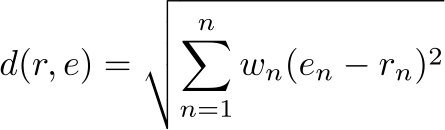

where
- _**r**_ is the vector _r_ = (_r_<sub>1</sub>, _r_<sub>2</sub>, ..., _r_<sub>n</sub>) of requested features
- _**w**_ is the vector _w_ = (_w_<sub>1</sub>, _w_<sub>2</sub>, ..., _w_<sub>n</sub>) of asigned weghts for each feature
- _**e**_ is the vector _e_ = (_e_<sub>1</sub>, _e_<sub>2</sub>, ..., _e_<sub>n</sub>) of evaluated values for each feature
- _**d**_ is the weighted Euclidean distance between two vectors
- _**c**_ is the total number or analyzed characteristics of the requested profile vector

The formula squares all weight values taken from the requested profile vector, mapping the values as follows:

| weightValue *w* | factor applied in the formula
| --------------- | -------------------------------------------------
| 0               | 0
| 0.25            | 0.0625
| 0.5             | 0.25
| 0.75            | 0.5625
| 1               | 1


---------
## Creation and manipulation of genotypes

A genotype can be create and modified in many ways. This is a summary of manipulations that can be made algorithmically or manually, typing from the user interface (red indicates changes):

| method            | description                                              | graphical example
| ----------------- | -------------------------------------------------------- | -----------------
| **createGen**     | creation of a brand new genotype                         |  
| **mutateLeaves**  | change of leaf values                                    | 
| **growTrunk**     | grow embedding the current genotype in a larger tree     | 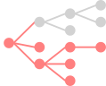
| **growBranch**    | grow a branch from a leaf                                | 
| **insertBranch**  | insert a branch in an intermediate node                  | 
| **flattenBranch** | computes a branch and flatten it as an encoded phenotype | 
| **pruneBranch**   | prune a branch replacing its processes with null data    | 
| **splitGen**      | remove part of the trunk returning one or more subtrees  | 

### Generating genotypes from random values

Universal random search space. All vectors are a valid input.

---------
## Subexpressions and autoreferences

---------
#### *Conclusiones de los tests sobre posibles maneras de autorreferenciar:*
- *La referencia por ruta (nodos atrás, y luego bifurcaciones hacia adelante) no es viable porque cuando aquí que referenciar al vuelo no está aún construidos los nodos de comunicación de la base).*

- *La referencia directa al número absoluto de subexpresión no funciona después de ciertos casos de growTrunk (con nodos anteriores al injerto, que cambian la numeración), ni de growBranches. Las soluciones son muy aparatosas.*

- *Renderizar la expresión referenciada y perder la autorreferencia es verboso, pierde la pureza del concepto, y sobre todo no funciona con las mutaciones de parámetros, ya que se pierde la autorreferencia tras cualquier manipulación de parámetros implicados.*

- *La referencia relativa parece ser la más sencilla y útil: `autoref(4)` indica que se referencia la funcióm que está 4 posiciones antes de la propia autorreferencia. Ventajas:*
  - *Con un solo número entero se referencia una ruta relativa, fácil de localizar visualmente también.*
  - *La mutaciones de parámetros con **mutateLeaves** funcionan perfectamente.*
  - *La aplicación de **growTrunk** no da problemas nunca. Cuando el tronco desarrolla ramificaciones anteriores al árbol existente, cambia la numeración absoluta de las funciones pero no la distancia relativa, por lo que no hay problema. Esto es importante porque seguramente será la evolución más natural de los genotipos.*
  - *Protocolo con **growBranch**:*
    - *Si la rama que crece no está involucrada en la autorreferencia, aunque cambie la numeración absoluta de las subexpresiones al estar antes de la autorreferencia, no cambian las distancias relativas, por lo que la autorreferencia sigue funcionando correctamente.*
    - *En el caso de que crezca una rama dentro del arco referencial, si crece desde un nodo referenciado, no hay problema, se mantienen las distancias, pero si crece en una rama intermedia se pierde la referencia. Estudiar soluciones.*
  - *Al hacer **insertBranch**, de nuevo sólo problema si la inserción está en una rama intermedia de la autorreferencia. Estudiar solución como en la anterior. Una opción es dejar que la autorreferencia cambie al punto correspondiente, sin más. Otra opción, tratar de hacer un cotejo previo, si no coincide la autorreferencia, se trata de corregir buscando la expresión (dado que es única y no hay duplicados) y cambiando el parámetro de autoref. Si la función ha desaparecido, la autoreferencia toma argumento 0 y es una función de efecto nulo.*
  - *Con **flattenBranch**, si después del cotejo la función ha desaparecido, se renderiza el contenido con el respaldo archivado de autoreferencias.*
  - *Con **pruneBranch** no tiene sentido renderizar la autoreferencia, dado que la fuente ha sido anulada. Si se consigue hacer el cotejo, si no existe la función para referenciar se hace autoref nula.*
  - *Al hacer **splitGen**, las referencias que sobrevivan se quedan, las que no pasan a ser nulas.*
  
- *A la hora de construir genotipos, si se crea una autoreferencia imposible se veta y se cambia a otra función no de autoreferencia. Así evitamos las autoref(0) que no significan nada.*

- *Una función de autoreferencia guarda un registro aparte de lo que está autoreferenciando para poder hacer un cotejo cuando sea necesario.

--------

- For simplicity, this examples use an only type of autoreference function, _**xAutoref(n)**_, where *x* would be the prefix or a correnponding function type.
- Nodes of the diagrams are blue to show internal autoreference pointers. Added, changed or deleted nodes are shown in red.
- Letters within nodes represent function names.

Given this function tree:


At the time of the evaluation of this expression, all the subexpressions (or nested functions) would be stored according to this order and format:

```
"1": "a",
"2": "b",
"3": "c(a,b)",
"4": "xAutoref(3)",
"5": "d",
"6": "e(c(a,b),xAutoref(3)",
"7": "f(e(c(a,b),xAutoref(3))",
"8": "xAutoref(1)",
"9": "xAutoref(5)",
"10": "g",
"11": "h(xAutoref(5),g)",
"12": "i(h(xAutoref(5),g))",
"13": "j",
"14": "xAutoref(11)",
"15": "k",
"16": "l(j,xAutoref(11),k)",
"17": "m(f(e(c(a,b),xAutoref(3))),xAutoref(1),i(h(xAutoref(5),g)),l(j,xAutoref(11),k)"
```

At the same time, during the evaluation itself these successive substitutions would be made when executing each `xAutoref` function:

- `"xAutoref(3)"` &rarr; `"a"`
- `"xAutoref(1)"` &rarr; `"f(e(c(a,b),xAutoref(3)))"` &rarr; `"f(e(c(a,b),a))"`
- `"xAutoref(5)"` &rarr; `"xAutoref(3)"` &rarr; `"a"`
- `"xAutoref(11)"` &rarr; `"c(a,b)"`

Final decoded genotype produced after all substitutions:
`"m(f(e(c(a,b),xAutoref(3))),xAutoref(1),i(h(xAutoref(5),g)),l(j,xAutoref(11),k)"`
&darr;
`"m(f(e(c(a,b),a)),f(e(c(a,b),a)),i(h(a,g)),l(j,c(a,b),k)"`

The following graph, showing the result of autoreference, is equivalent to the previous one:


--------
### Autoreferences after *mutateLeaves*


--------
### Autoreferences after *growTrunck*


(Autoreferences nodes are terminal as leaves)


--------- 
## Evolution of specimens
### Flowchart
### Selecting and processing specimens

--------- 
## Specimen data structure

All generated specimens are stored as temporary JSON files. Selected specimens are permanently saved as JSON files in the Specimen catalogue. These JSON files are created according to the following data structure:

- **"metadata"**: data to identify and classify the specimen within the catalogue.
  - **"specimenID"**: unique specimen identificator base on date of creation compressed as a unique number and usersname
  - **"permalink**: permanent link to the JSON file of the specimen (only for selected specimens, not for temporary ones)
  - **"GenoMusVersion"**: GenoMus version that generated the specimen
  - **"creationTimecode"**: creation date compressed as a unique number
  - **"user"**: username
  - **"globalRating"**: average of human ratings obtained, based on all evaluations
  - **"iterations"**: number of iterations of the algorithm until finding this specimen
  - **"millisecondsElapsed"**: time elapsed until finding this specimen
  - **"encGenotypeLength"**: length of the float array contaning the encoded genotype
  - **"encPhenotypeLength"**: length of the float array contaning the encoded phenotype
  - **"decPhenotypeDuration"**: total duration of the generated piece in seconds
  - **"depth"**: deepest level of ramification of the decoded genotype function tree
  - **"totalFunctions**: total of different functions used
- **"initialConditions"**: set of initial conditions to satisfy by the generative process [(more info)](#initial-conditions-for-generation-of-genotypes)
  - **"species"**
    - **"eventParameters"**: event parameters structure defining the basic sonic events
  - **"functionLibrary"**
  - **"includedFunctions"**
  - **"excludedFunctions"**
  - **"mandatoryFunctions"**
  - **"eligibleFunctions"**
  - **"requestedProfile"**
  - **"genMaxLength"**
  - **"phenMinLength"**
  - **"phenMaxLength"**
  - **"maxIterations"**
- **"encodedGenotype"**: array of floats &isinv; [0, 1]
- **"decodedGenotype"**: string containing the genotype function tree
- **"formattedGenotype"**: string containing the decoded genotype, formatted with blanks and line breaks to clearly display the function tree
- **"leaves"**: array with all leaf values and their corresponding position in the encoded genotype.
- **"subexpressions"**: list of all functional substructures within a genotype, enumerated by output type and order of appearance
  - **"scoreF"**: subexpressions whose output is of type score
  - **"voiceF"**: ...
  - **"eventF"**
  - **"listF"**
  - **"paramF"**
  - **"harmonyF"**
  - ...
- **"encodedPhenotype"**: array of floats &isinv; [0, 1].
- **"decodedPhenotype"**: phenotype converted to the desired formats (bach roll, bach score, lilypond, MusicXML, Csound, multimedia outputs, etc.)
- **"autoanalitycProfile"**: [(more info)](#specimen-autoanalytic-profile) 
  - **"autoreference"**
  - **"variability"**
  - **"rhythmDensity"**
  - **"rhythmComplexity"**
  - **"polyphony"**
  - **"chromatism"**
  - **"dissonance"**
  - **"disjunctivity"**
  - **"modalChroma"**
  - **"tonalStability"**
  - **"tessituraDispersion"**
  - **"globalArticulation"**
  - **"articulationHomogeneity"**
  - **"globalDynamics"**
  - **"dynamicHomogeneity"**
- **"evolutionLog"**: log covering the history of actions and manipulations operated on the specimen 
- **"humanEvaluation"**: human evaluation of different musical, aesthetic and emotional aspects of the specimen. This item store the assessment of many different users and give the average rating for different musical aspects
  - **"aestheticValue"**
  - **"originality"**
  - **"mood"**
  - **"emotionalIntensity"**
  - **"evaluations"**
    - _**username1**_
      - **"aestheticValue"**
      - **"originality"**
      - **"mood"**
      - **"emotionalIntensity"**
    - _**username2**_
      - ...
    - ...

---------
## Specimen catalogue
### Naming
### Classification
### Catalogue access

---------
# Max user interface
