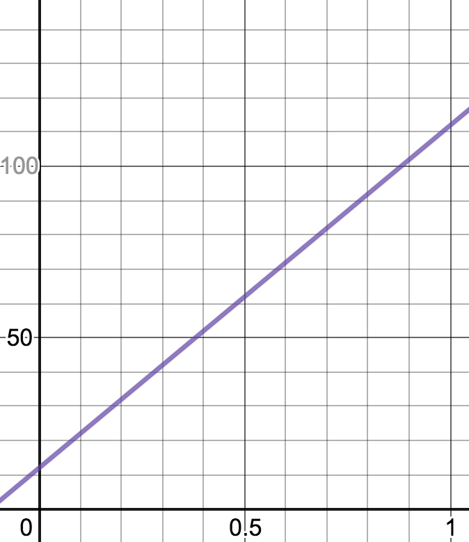
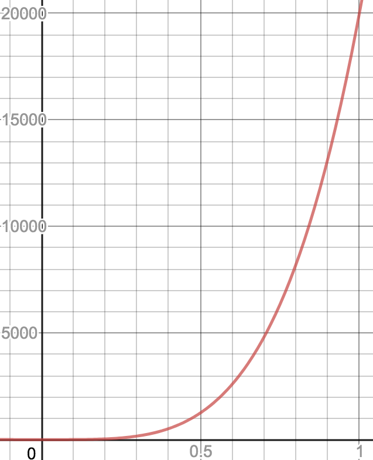
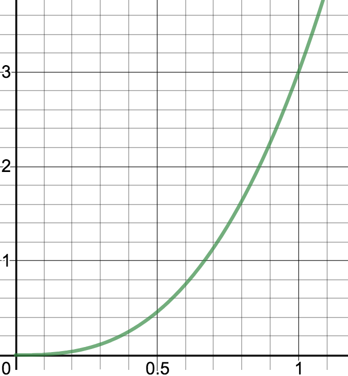

# GenoMus grammar specifications

In progress...

-------------

## Table of Contents
- [Definitions](#definitions)
- [Function types for genotypes](#function-types-for-genotypes)
  - [Main structures](#main-structures)
  - [Human-readable leaf parameters](#human-readable-leaf-parameters) 
    - [Duration](#duration)
    - [Pitch](#pitch)
    - [Articulation](#articulation)
    - [Intensity](#intensity)
  - [Special formats](#special-formats)
  - [Manual manipulation of genotypes](#manual-manipulation-of-genotypes)
- [Including a function in the GenoMus catalogue](#including-a-function-in-the-genomus-catalogue)
- [Parameter mapping](#parameter-mapping)
  - [Duration](#duration-1)
    - [notevalueF (n)](#notevaluef-n)
    - [durationF (d)](#durationf-d)
  - [Pitch](#pitch-1)
    - [midipitchF (m)](#midipitchf-m)
    - [frequencyF (f)](#frequencyf-f)
  - [Articulation](#articulation-1)
    - [articulationF (a)](#articulationf-a)
  - [Intensity](#intensity-1)
    - [intensityF (i)](#intensityf-i)
    
- [Encoding-decoding](#encoding-decoding)
  - [Decoded genotype](#decoded-genotype)
  - [Encoded genotype](#encoded-genotype)
  - [Decoded phenotype](#decoded-phenotype)
  - [Encoded phenotype](#encoded-phenotype)
- [Specimen characterization and evaluation](#specimen-characterization-and-evaluation)
  - [Automatic analisys](#automatic-analisys)
  - [Human aesthetic evaluation](#human-aesthetic-evaluation)
- [Specimen data structure](#specimen-data-structure)
- [Catalogue of specimens](#catalogue-of-specimens)
  - [Naming](#naming)
  - [Classification](#classification)
  - [Catalogue access](#catalogue-access)
- [Initial conditions for generation of genotypes](#initial-conditions-for-generation-of-genotypes)
  - [Vector of desired musical characteristics](#vector-of-desired-musical-characteristics)
    - [Weighted measurement of Euclidean distance](#weighted-measurement-of-euclidean-distance)
----------  
## Definitions
- **genotype**: Function tree representing compositional procedures.
- **phenotype**: Music score generated by a genotype.
- **encoded genotype**: Genotype coded as an array of normalized floats within the closed interval [0, 1].
- **decoded genotype**: Genotype coded as a string containing an executable tree of functions.
- **encoded phenotype**: Phenotype coded as an array of normalized floats within the closed interval [0, 1].
- **decoded phenotype**: Phenotype coded as a readable score for music software, such as Max, Csound, Lilypond, etc.
- **specimen**: Genotype/phenotype pair, saved as JSON file containing encoded and decoded versions of its code, metadata and many other useful analytical informations.
- **parameter**: Normalized float from interval [0, 1] used to feed the functions' required arguments. These numeric values are leaves of the functional tree that gives rise to a genotype.
- **leaf**: Terminal node of a genotype functional tree, containing a parameter.
- **list**: Array of parameters.
- **chord**: Simplest sonic event. In traditional music writing, a note. The default atributes of a chord are: [duration, pitch, articulation, intensity]. A chord can contain more than one pitch. Chords with more parameters can be set, for example, for electroacoustic works, where a sonic event could be defined by dozens or features. A note can consist of two or more concatenated pitches together. Chords can be concatenated only sequentially (one after another, without overlapping). Overlapping effect among chords inside the same voice can be achieved by means of articulation. A chord can be extended to other domains beyond music, like visuals, lighting, etc., along with musical events, or standalone. 
- **voice**: Line of music (usually for an only instrument). A voice is a wrapper for a sequence of one or more chords. A voice can consist of two or more voices sequentially concatenated  together (one after another, without overlapping). Each chord inside a voice can contain more than one pitch. For instance, a sequence of major chords can be a single voice.
- **score**: Excerpt or a whole piece of music. A score is a wrapper for one or more voices. A score can consist of two or more scores together. Scores can be concatenated sequentially (one after another) or simultaneously (sounding together). The product of these concatenations is a new score. The chord-voice-score structure is defined after [bach](https://www.bachproject.net/) paradigm, to facilitate the visualization and interactions with phenotypes in Max environment.
- **duration**: Time length from the beginning of a chord to the beginning of the next chord, into the same voice. 
- **pitch**: Each of the root frecuencies in a chord.
- **articulation**: Length of the chord sound. It can be different from the chord duration. If articulation matchs the duration, a perfect legato among chords will be played. Shorter or larger values for articulation will sound as staccato or lasciare vibrare effects.
- **intensity**: Dynamic of a chord.
- **function type identifier**: Prefix used to name functions, to ease the function type identification. The use of indentifiers is not compulsory, but very convenient for readability of decoded genotypes.
---------
## Function types for genotypes
Functions in GenoMus are classified by their output data. 
### Used function type identifiers
~~**a** **b** **c** **d** **e** **f** **g** **h** **i**~~ j k ~~**l** **m** **n** **o** **p** **q** **r** **s** **t** **u** **v** **w**~~ x y z
### Main structures

| *function type* | *identifier* | *output*
| --------------- | ------------ | --------
| **scoreF**      | **s**        | score
| **voiceF**      | **v**        | voice
| **chordF**      | **c**        | chord
| **listF**       | **l**        | list of normalized floats from interval [0, 1]
| **paramF**      | **p**        | normalized parameter
| **leaf**        | -            | norm. parameter or specific format parameter

The **leaf** type is a flag for terminal nodes. This is not really a type of function, but a label to indicate that a new function will not be called.

### Human-readable leaf parameters
Function types created to allow a more user-friendly handling of decoded genotypes. All these functions are intended to replace a **paramF** in a leaf position of function tree.
#### Duration

| *function type* | *identifier* | *output*
| --------------- | ------------ | --------
| **notevalueF**  | **n**        | normalized duration, from usual number used for note values (1 = whole note)
| **durationF**   | **d**        | normalized duration, from time in seconds

#### Pitch

| *function type* | *identifier* | *output*
| --------------- | ------------ | --------
| **midipitchF**  | **m**        | normalized pitch from standard MIDI pitch
| **frequencyF**  | **f**        | normalized pitch from frequency in Hz

#### Articulation

| *function type*   | *identifier* | *output*
| ----------------- | ------------ | --------
| **articulationF** | **a**        | normalized relative articulation (1 is whole duration of the note, 2 is double duration)
| **durationF**     | **d**        | normalized duration, from time in seconds

#### Intensity

| *function type* | *identifier* | *output*
| --------------- | ------------ | --------
| **intensityF**  | **i**        | normalized intensity from standard MIDI velocity

### Special formats
Function types created to manage specific types of data (some of them are still purely theoretical)

| *function type* | *identifier* | *output*
| --------------- | ------------ | --------
| **operationF**  | **o**        | result of an arithmetic operation, useful to construct recursive mathematical expressions inside a genotype
| **binaryF**     | **b**        | boolean value (only 0 or 1)
| **harmonyF**    | **h**        | pitch class set, useful for specifying scales, modes, chords, pitch aggregates, harmonic series, etc.
| **rhythmF**     | **r**        | rythmical patter class set
| **quantizF**    | **q**        | numeric structure for quantization of rhythm
| **externalF**   | **e**        | reference of an external genotype from a library (to be used with function referencing to external data)
| **genotypeF**   | **g**        | raw encoded genotype (array of floats from interval [0, 1])
| **txtF**        | **t**        | string
| **waveF**       | **w**        | encoded path to read data from an stored audio file


### Manual manipulation of genotypes
Functions to be used typing manually on the genotypes to get a more controlled evolution.

| *function type* | *identifier* | *output* |
| --------------- | ------------ | --------
| **userF**       | **u**        | these functions perform very different manipulations on part of a genotype, acting as a metalevel of functional control

User functions use uppercase letters to be easily found during manual editing processes. Some examples of this type:
- **uEVOLVE** (*expr*) - contains the part of a genotype to be transformed, freezing the rest
- **uFREEZE** (*expr*) - block a part of a genotype to be preserved from transformations
- **uFLATTEN** (*expr*) - render part of a genotype into a simple declarative score/voice/chord (phenotype)
---------
## Including a function in the GenoMus catalogue
A functions must be included into the JSON GenoMus catalogue following this format:
```
"functionType": {
    "functionName": {
        "arguments": ["functionType", "functionType", ...],
        "description": "String describing what the function does.",
        "metadata": {
            "tag1": "Optional information when needed.",
            "tad2": "Interesting metada could be user, date of inclusion, etc."
        }
    },
```
- _**functionName**_ should use the corresponding prefix to help a human to know its output type
- The _**description**_ and _**metadata**_ fields are optional, but very helpful to understand quicky the processes in a genotype, and to add further informations and documentation about the function or the programmer

Furthermore, each function must be included in the catalogue list of function index numbers:
```
"functionIndex": {
    1: {
        "functionName": 0.6180339887498949
    },
    2: {
        "functionName": 0.2360679774997898
    },
    ...
}
```
The integer index identifies the function. The float is the number to map the function within the normalized interval [0, 1]. Encoded genotypes use this float to map all functions optimizing the maximal distance among functions into the interval. That's a critical issue for the automatic characterization of genotypes by machine learning techniques. To maintain coherence of the catalogue, once numbered, a function can never use a different index. Index numbers never can be shared with other functions. The floats are generated using a golden angle iteration mapped on the [0, 1] interval using this formula:


where f<sub>e</sub> is the index to identify the function in encoded genotypes and f<sub>d</sub> is the correspondent decoded index, which is asigned incrementally in the catalogue.

From the functionIndex dictionary, an inverse dictionary is automatically created reordering the functions according to their encoded index, following this format:

```
var encodedFunctionIndexes = {
    "0.2360679774997898": "functionNameX",
    "0.6180339887498949": "functionNameY",
    ...
}
```

This is an useful lookup table for different automatic and manual processes.

---------
## Parameters mapping
A typical function expects generic parameters (floats from normalized interval [0, 1]) as arguments, regardless arguments' domain. When computing phenotypes, these numbers must be mapped to right ranges and scales, to represent duration, pitch, etc.

Human-readable function types uses more user-friendly argument formats. These non-generic parameters are first mapped to a normalized interval [0, 1] to be later evaluated and encoded as stardard normalized paramenters.

In general, theses maps are not linear (straight line maps). For each type of parameter, a gaussian approach is made, trying to cover a wide range of values for each category, but at the same time modeling the conversion in such a way that central values (specially the range [0.25, 0.75]) map to the musical values that appear more often.

In summary, conversions are used in several ways:
- From normalized parameter to domain-specific scales used for rendering phenotypes (scores or soundfiles).
- Backwards, from arguments entered with user-friendly function-types that will return a normalized parameter.
- To display decodedGenopytes in a more human-readable way.

--------
### Duration

#### **notevalueF** (n) 

Input can be the usual ratio for each note value or a float. This value is relative, and its actual duration will depend on the current tempo mark. 

Conversion formulae: normalized parameter _**p**_ to note value ratio _**v**_ and inverse ([graph](https://www.desmos.com/calculator/ysm8zt5rbl)):


| [0, 1] | *v* (float)  | *v* (ratio) | notation (Am) / (Br)                    | seconds if &#9833;= 60 
| ------ | ------------ | ----------- | --------------------------------------- | ---------------------- 
| 0      | 0.00390625   | 1/256       | 256th note / demisemihemidemisemiquaver | 0.015625               
| 0.1    | 0.0078125    | 1/128       | 128th note / semihemidemisemiquaver     | 0.03125                
| 0.2    | 0.015625     | 1/64        | 64th note / hemidemisemiquaver          | 0.0625                 
| 0.3    | 0.03125      | 1/32        | 32th note / demisemiquaver              | 0.125                  
| 0.4    | 0.0625       | 1/16        | 16th note / semiquaver                  | 0.25                   
| 0.5    | 0.125        | 1/8         | 8th note / quaver                       | 0.5                    
| 0.6    | 0.25         | 1/4         | quarter note / crotchet                 | 1                      
| 0.7    | 0.5          | 1/2         | half note / minim                       | 2                      
| 0.8    | 1            | 1           | whole note / semibreve                  | 4                      
| 0.9    | 2            | 2           | double note / breve                     | 8                      
| 1.0    | 4            | 4           | quadruple note / longa                  | 16                     

#### **durationF** (d) 

Conversion formulae: normalized parameter _**p**_ to seconds _**s**_ and inverse ([graph](https://www.desmos.com/calculator/pn1nbunlcz)):


| [0, 1] |  dur. (s)   
| ------ | -------- 
| 0      | 0.015625 
| 0.1    | 0.03125  
| 0.2    | 0.0625   
| 0.3    | 0.125    
| 0.4    | 0.25     
| 0.5    | 0.5      
| 0.6    | 1        
| 0.7    | 2        
| 0.8    | 4        
| 0.9    | 8        
| 1.0    | 16       

--------
### Pitch
#### **midipitchF** (m)

Linear conversion keeping encoded normalized data easily readable.

Conversion formulae: normalized parameter _**p**_ to MIDI pitch _**m**_ and inverse ([graph](https://www.desmos.com/calculator/atupolxw6d)):


s

| [0, 1]  |  MIDI    | Notation
| ------  | -------- | ----------
| 0       | 12       | C<sub>0</sub>
| 0.09    | 21       | A<sub>0</sub> <sub>(lowest piano key)</sub>
| 0.12    | 24       | C<sub>1</sub>
| 0.24    | 36       | C<sub>2</sub>
| 0.36    | 48       | C<sub>3</sub>
| 0.48    | 60       | C<sub>4</sub> <sub>(middle C)</sub>
| 0.5     | 62       | D<sub>4</sub> <sub>(central note between flats and sharps)</sub>
| 0.60    | 72       | C<sub>5</sub>
| 0.72    | 84       | C<sub>6</sub>
| 0.84    | 96       | C<sub>7</sub>
| 0.96    | 108      | C<sub>8</sub> <sub>(highest piano key)</sub>
| 1.0     | 112      | E<sub>8</sub>
 
#### **frequencyF** (f)

Conversion formulae: normalized parameter _**p**_ to frequency in hertz _**h**_ and inverse ([graph](https://www.desmos.com/calculator/ixocptnpba)):




| [0, 1] |  Hz      
| ------ | -------- 
| 0      | 0.000001 
| 0.1    | 2        
| 0.2    | 32       
| 0.3    | 162      
| 0.4    | 512      
| 0.5    | 1250     
| 0.6    | 2592     
| 0.7    | 4802     
| 0.8    | 8192     
| 0.9    | 13122    
| 1.0    | 20000    

--------
### Articulation

Articulation can be used in two modes:

- absolute articulation: The duration of the sound is measured in seconds, and is independent of tempo and chord duration. The **durationF** function type is used for this articulation. 
- relative articulation: the duration of the sound is a ratio of the chord duration. 1 means that the sound will last the whole duration, 0.5 is the half of the chord duration, and so on. For this proportional articulation the function type **articulationF** must be employed.

#### **articulationF** (a)
Conversion formulae: normalized parameter _**p**_ to relative articulation _**a**_, as a proportion of chord duration ([graph](https://www.desmos.com/calculator/i5jiq4k9ah)):




| [0, 1] |  proportion of chord duration | notation
| ------ | ----------------------------- | --------
| 0      | 0                             | silence
| 0.1    | 0.005739                      |
| 0.2    | 0.037768                      | *staccatissimo*
| 0.3    | 0.113708                      |
| 0.4    | 0.248547                      | *staccato*
| 0.5.   | 0.455866                      |    
| 0.52   | 0.507152                      | *non legato*
| 0.6    | 0.748296                      |
| 0.66   | 0.969596                      |
| 0.6676 | 1.002468                      | *legato*
| 0.7    | 1.137769                      |
| 0.8    | 1.635658                      | *legatissimo*
| 0.9    | 2.252888                      |
| 1.0    | 3                             | *lasciare vibrare*

--------
### Intensity
#### **intensityF** (i)
Conversion formulae: normalized parameter _**p**_ to intensity _**i**_ in standard MIDI velocity  and inverse ([graph](https://www.desmos.com/calculator/cisndyw3gs)):


| [0, 1] |  MIDI velocity      | notation
| ------ | ------------------- | --------
| 0      | 0                   |  silence
| 0.06   | 7.62                | **_pppp_**
| 0.15   | 19.05               | **_ppp_**
| 0.25   | 31.75               | **_pp_**
| 0.33   | 41.91               | **_p_**
| 0.4    | 50.8                | **_mp_**
| 0.5    | 63.5                | **_mf_**
| 0.66   | 83.82               | **_f_**
| 0.75   | 95.25               | **_ff_**
| 0.9    | 114.3               | **_fff_**
| 1.0    | 127                 | *tutta forza*

---------
## Genotype operations
### Creation
#### Self-references
### Mutation
### 


## Encoding-decoding
### Decoded genotype
### Encoded genotype
|  type                                | identifier | value                  | example encoded &rightarrow; decoded 
| ------------------------------------ | ---------- | ---------------------- | ------------------------------------
| leaf <sub>normalized parameter</sub> | 0          | parameter              | `[0, 0.3451]` &rightarrow; `"0.3451"` 
| leaf <sub>notevalueF</sub>           | 0.01       | normalized parameter   | [0.01, 0.3] &rightarrow; "1/32" 
| leaf <sub>durationF</sub>            | 0.02       | normalized parameter   | [0.01, 0.3] &rightarrow; "0.125" 
| leaf <sub>midipitchF</sub>           | 0.03       | normalized parameter   | [0.01, 0.3] &rightarrow; "42" 
| leaf <sub>frequencyF</sub>           | 0.04       | normalized parameter   | [0.01, 0.3] &rightarrow; "162" 
| leaf <sub>articulationF</sub>        | 0.05       | normalized parameter   | [0.01, 0.3] &rightarrow; "0.113708" 
| leaf <sub>intensityF</sub>           | 0.06       | normalized parameter   | [0.01, 0.3] &rightarrow; "38.1" 
| leaf <sub>*newtypeF*</sub>           | ...        | normalized parameter   | [0.01, 0.3] &rightarrow; *normalized converted value* 
| ,                                    | 0.2        | -                      | [0.2] &rightarrow; "," 
| \[                                   | 0.4        | -                      | [0.4] &rightarrow; "\[" 
| \]                                   | 0.6        | -                      | [0.6] &rightarrow; "\]" 
| \)                                   | 0.8        | -                      | [0.8] &rightarrow; "\)"
| function name + \(                   | 1          | encoded function index | [1, 0.61803] &rightarrow; "*functionName*("

### Decoded phenotype
### Encoded phenotype

## Specimen characterization and evaluation
### Automatic analisys
- Duration
- Genotype length
- Phenotype length
- Deepest functional level
- Number of different functions used  
- Polyphonic complexity
- Diatonicity (measured at different time scales)
- Consonance
- Intervalic disjunctivity
- Modal chroma
- Tessitura dispersion
- Temperament
- "Tonicity" (how many changes in terms of root notes)
- Rhythmical complexity
- Variability
- Articulation homogeneity
- Dynamic homogeneity
- Level of self-reference (reuse of internal substructures)

### Human aesthetic evaluation
Intended to be highly subjective, with the aim of modeling personal styles.
- Personal aesthetic interest
- Originality
- Complexity
- Emotional axes
  - Sadness - Joy
  - Nervousness - Tranquility
  - Simple - Complex
  
 
## Specimen data structure

## Catalogue of specimens
### Naming
### Classification
### Catalogue access

## Initial conditions for generation of genotypes
### Vector of desired musical characteristics
#### Weighted measurement of Euclidean distance


