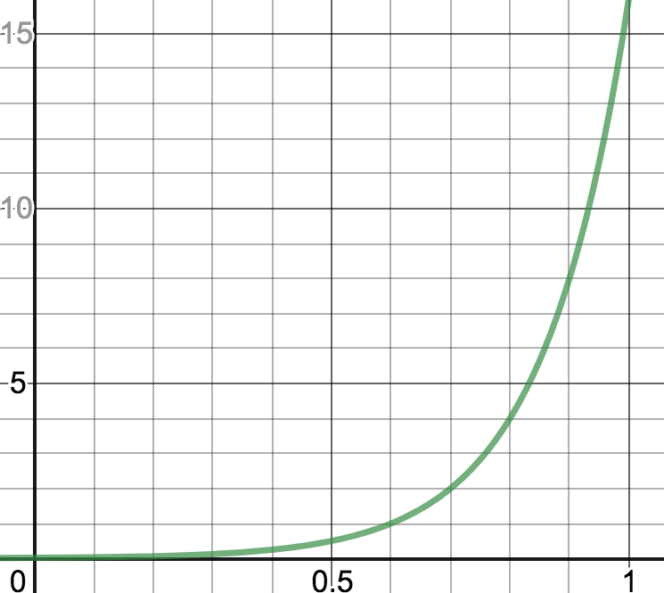
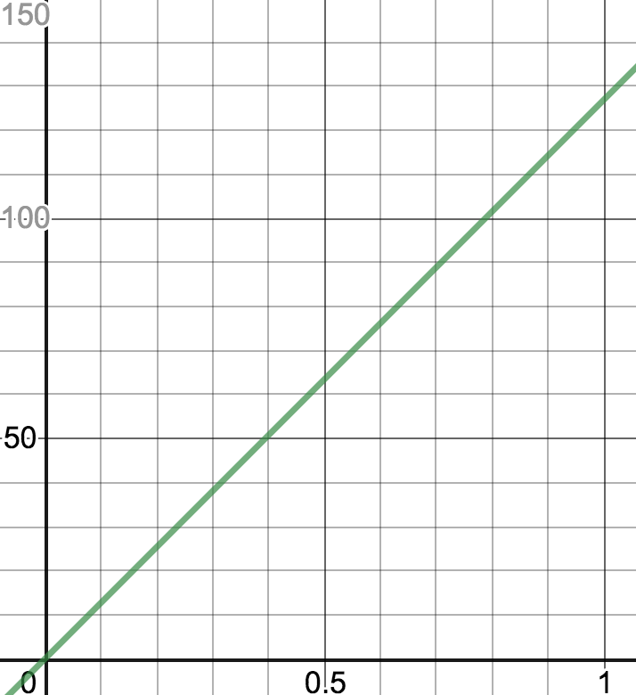
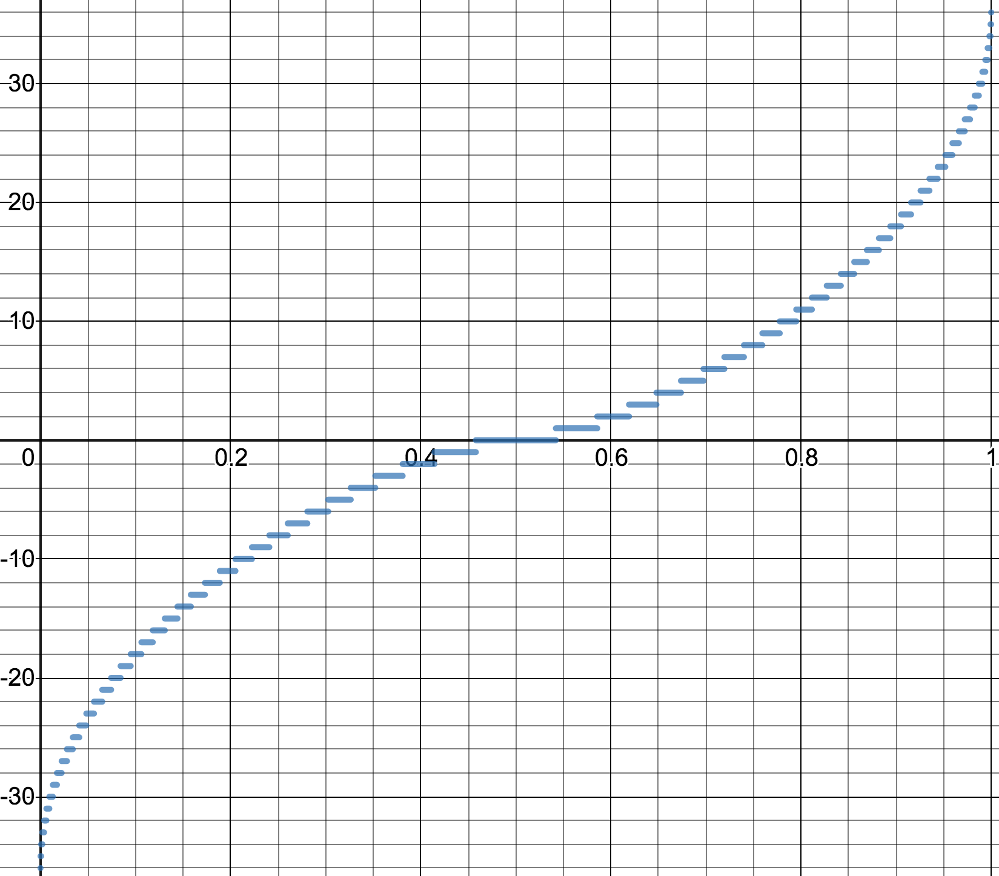

# GenoMus specifications


--------
## Table of Contents
- [Definitions](#definitions)
- [Anatomy of a genotype function](#anatomy-of-a-genotype-function)
  - [Input arguments](#input-arguments)
  - [Output data structure](#output-data-structure)
- [Function types for genotypes](#function-types-for-genotypes)
  - [Main structures](#main-structures)
  - [Special formats](#special-formats)
  - [Human-readable leaf parameters](#human-readable-leaf-parameters) 
    - [Duration](#duration)
    - [Pitch](#pitch)
    - [Articulation](#articulation)
    - [Intensity](#intensity)
    - [Integer x steps](#integer-x-steps)
  - [Human-readable lists](#human-readable-lists) 
  - [Manual manipulation of genotypes](#manual-manipulation-of-genotypes)
- [GenoMus function catalogues](#genomus-function-catalogues)  
  - [Indexing a function in a GenoMus function catalogue](#indexing-a-function-in-a-genomus-function-catalogue)
  - [Encoded function index generation](#encoded-function-index-generation)
- [Parameter mapping](#parameter-mapping)
  - [Duration](#duration-1)
    - [notevalueF (n)](#notevaluef-n)
    - [durationF (d)](#durationf-d)
  - [Pitch](#pitch-1)
    - [midipitchF (m)](#midipitchf-m)
    - [frequencyF (f)](#frequencyf-f)
  - [Articulation](#articulation-1)
    - [articulationF (a)](#articulationf-a)
  - [Intensity](#intensity-1)
    - [intensityF (x)](#intensityf-i)
  - [Integer x steps](#integer-x-steps-1)
    - [xstepsF (x)](#xstepsf-x)    
- [Encoding-decoding genotypes](#encoding-decoding-genotypes)
  - [Conversion table for genotypes](#conversion-table-for-genotypes)
  - [Examples](#examples)
    - [Minimal genotype](#minimal-genotype)
    - [Minimal genotype with human-readable leaf parameters](#minimal-genotype-with-human-readable-leaf-parameters)
    - [List encoding](#list-encoding)
- [Encoding-decoding phenotypes](#encoding-decoding-phenotypes)
- [Genotype substructures](#genotype-substructures)
    - [Genotype scaffolding](#genotype-scaffolding)
    - [Function network](#function-network)
    - [Leaves vector](#leaves-vector)
    - [Subexpressions](#subexpressions)
- [Initial conditions for generation of genotypes](#initial-conditions-for-generation-of-genotypes)
  - [Vector of desired musical characteristics](#vector-of-desired-musical-characteristics)
    - [Weighted measurement of Euclidean distance](#weighted-measurement-of-euclidean-distance)
- [Specimen data structure](#specimen-data-structure)
- [Specimen catalogue](#specimen-catalogue)
  - [Naming](#naming)
  - [Classification](#classification)
  - [Catalogue access](#catalogue-access)
- [Max user interface](#max-user-interface)
----------  
## Definitions
- **genotype**: Function tree representing compositional procedures.
- **phenotype**: Music score generated by a genotype.
- **encoded genotype**: Genotype coded as an array of normalized floats within the closed interval [0, 1].
- **decoded genotype**: Genotype coded as a string that contains a function tree, executable in JavaScript.
- **encoded phenotype**: Phenotype coded as an array of normalized floats within the closed interval [0, 1].
- **decoded phenotype**: Phenotype coded as a readable score for music software, such as Max, Csound, Lilypond, etc.
- **specimen**: Genotype/phenotype pair, saved as JSON file containing encoded and decoded versions of its code, metadata and many other useful analytical informations.
- **species**: Group of specimens that share the same parameter structure of their simplest musical events.
- **genotype function**: Minimum computable unit of a genotype. It is designed in a modular way to easily take other genotype functions as arguments.
- **parameter**: Normalized float &isinv; [0, 1] used to feed the functions' required arguments. These numeric values are leaves of the functional tree that gives rise to a genotype.
- **leaf**: Terminal node of a genotype functional tree, containing a parameter.
- **list**: Array of parameters.
- **chord**: Simplest sonic event. In traditional music writing, a note. The default atributes of a chord are: [duration, pitch, articulation, intensity]. A chord can contain more than one pitch. Chords with more parameters can be set, for example, for electroacoustic works, where a sonic event could be defined by dozens of features. A note can consist of two or more concatenated pitches. Chords can be concatenated only sequentially (one after another, without overlapping). Overlapping effect among chords inside the same voice can be achieved by means of articulation. A chord can be extended to other domains beyond music, like visuals, lighting, etc., along with musical events, or standalone. 
- **voice**: Line of music (usually for an only instrument). A voice is a wrapper for a sequence of one or more chords. A voice can consist of two or more voices sequentially concatenated  together (one after another, without overlapping). Each chord inside a voice can contain more than one pitch. For instance, a sequence of major chords can be a single voice.
- **score**: Excerpt or a whole piece of music. A score is a wrapper for one or more voices. A score can consist of two or more scores together. Scores can be concatenated sequentially (one after another) or simultaneously (sounding together). The product of these concatenations is a new score. The chord-voice-score structure is defined after [bach](https://www.bachproject.net/) paradigm, to facilitate the visualization and interactions with phenotypes in Max environment.
- **duration**: Time length from the beginning of a chord to the beginning of the next chord, into the same voice. 
- **pitch**: Each of the root frecuencies in a chord.
- **articulation**: Length of the chord sound. It can be different from the chord duration. If articulation matchs the duration, a perfect legato among chords will be played. Shorter or larger values for articulation will sound as staccato or lasciare vibrare effects.
- **intensity**: Dynamic of a chord.
- **GenoMus function catalog**: JSON file that lists and characterizes all the available functions for genotype generation of a species.
- **function type identifier**: Prefix used to name functions, to ease the function type identification. The use of identifiers is not compulsory, but very convenient for readability of decoded genotypes.
- **function index**: Integer assigned incrementally to identify each function with a unique number in the GenoMus functions catalogue. 
- **encoded function index**: Float generated to identify each function with a unique number. These numbers are chosen using the function index as input for an algorithm designed to obtain an optimized distribution of these normalized identifiers &isinv; [0, 1].
- **eligible functions**: Set of functions that determine which ones can be chosen during the genotype generation process. Somehow, this set can characterize a composer or a style.
- **genotype seed**: Number used to initialize the pseudorandom number generator before the genotype generation process starts. It allows repeatable results. Ultimately, a genotype can be identified only by this number, since it determines the entire decision tree that generates it.
- **phenotype seed**: Number used to initialize the pseudorandom number generator before the genotype evaluation process starts, which allows producing repeatable phenotypes. When a genotype includes random processes, many different phenotypes from the same genotype can arise. In this case, each different result can be indentified with a phenotype seed. So, given specific initial conditions, a single specimen can be identified only by two integers: genotype and phenotype seeds.

---------
## Anatomy of a genotype function

### Input arguments


### Output data structure 
To enable effective chaining of functions, all functions inside a genotype share the same output data structure. This output data is returned within an array according to the following order of elements:

| index | variable name | data type | description
| ----- | -------------- | ----- | ----------
| **0** | **funcType**  | string | **Function type** according to its output (see [reference](#function-types-for-genotypes))
| **1** | **decGenOut** | string  | **Decoded genotype** excerpt. Functional expression of the genotype branch computed until that node, including the function itself.
| **2** | **encPhenOut** | array of floats &isinv; [0, 1] | **Encoded phenotype** excerpt. Transformation of the input data made with the compositional procedures of the function itself.
| **3** | **phenLength** | integer | Number of phenotype chords generated so far. Useful for subsequent functions to avoid overly large processes.
| **4** | **tempo** | float | Tempo of the phenotype. The float uses the [durationF](#durationf-d) format to indicate the duration of a quarter note. Default value: 0.6 (equivalent to &#9833;= 60)

Variable names inside each genotype function are not compulsory, but is highly recommended to maintain the same nomenclature to improve code readability and reusability.

---------
## Function types for genotypes
Functions in GenoMus are classified by their output data. 
### Used function type identifiers
~~**a** **b** **c** **d** **e** **f** **g** **h** **i**~~ j k ~~**l** **m** **n** **o** **p** **q** **r** **s** **t** **u** **v** **w** **x**~~ y z

---------
### Main structures

| *function type* | *identifier* | *output*
| --------------- | ------------ | --------
| **scoreF**      | **s**        | score
| **voiceF**      | **v**        | voice
| **chordF**      | **c**        | chord
| **listF**       | **l**        | list of normalized floats &isinv; [0, 1]
| **paramF**      | **p**        | normalized parameter
| **leaf**        | -            | norm. parameter or specific format parameter

The **leaf** type is a flag for terminal nodes. This is not really a type of function, but a label to indicate that a new function will not be called.

---------
### Special formats
Function types created to manage specific types of data (some of them are still purely theoretical)

| *function type* | *identifier* | *output*
| --------------- | ------------ | --------
| **operationF**  | **o**        | result of an arithmetic operation, useful to construct recursive mathematical expressions inside a genotype
| **binaryF**     | **b**        | boolean value (only 0 or 1)
| **harmonyF**    | **h**        | pitch class set, useful for specifying scales, modes, chords, pitch aggregates, harmonic series, etc.
| **rhythmF**     | **r**        | rhythmical pattern class set
| **quantizF**    | **q**        | numeric structure for quantization of rhythm
| **externalF**   | **e**        | pointer to an external genotype from a library (to be used with functions referencing external data)
| **genotypeF**   | **g**        | raw encoded genotype (array of floats &isinv; [0, 1])
| **txtF**        | **t**        | string
| **waveF**       | **w**        | encoded path to read data from an stored audio file

---------
### Human-readable leaf parameters
Function types created to improve manual handling of decoded genotypes. These functions can replace a **paramF** functions in a leaf position of function tree.
#### Duration

| *function type* | *identifier* | *output*
| --------------- | ------------ | --------
| **notevalueF**  | **n**        | normalized duration from usual number used for note values (1 = whole note)
| **durationF**   | **d**        | normalized duration from duration in seconds

#### Pitch

| *function type* | *identifier* | *output*
| --------------- | ------------ | --------
| **midipitchF**  | **m**        | normalized pitch from standard MIDI pitch
| **frequencyF**  | **f**        | normalized pitch from frequency in Hz

#### Articulation

| *function type*   | *identifier* | *output*
| ----------------- | ------------ | --------
| **articulationF** | **a**        | normalized relative articulation (1 is whole duration of the note, 2 is double duration)
| **durationF**     | **d**        | normalized duration from time in seconds

#### Intensity

| *function type* | *identifier* | *output*
| --------------- | ------------ | --------
| **intensityF**  | **i**        | normalized intensity from standard MIDI velocity

#### Integer x steps

| *function type* | *identifier* | *output*
| --------------- | ------------ | --------
| **xstepsF**     | **x**        | normalized value from integer &isinv; [-36, 36]

---------
### Human-readable lists

These functions receive a list of human-readable leaf parameters and return a normalized list, which can be seamlessly integrated into automatic processes.

| *function type*    | *identifier* | *output*
| ------------------ | ------------ | --------
| **lnotevalueF**    | **ln**       | list of normalized durations from list of note values (1 = whole note)
| **ldurationF**     | **ld**       | list of normalized durations from list of duration in seconds
| **lmidipitchF**    | **lm**       | list of normalized pitches from list of MIDI pitches
| **lfrequencyF**    | **lf**       | list of normalized pitches from frequencies in Hz
| **larticulationF** | **la**       | list of normalized relative articulations from list of relative articulations
| **lintensityF**     | **li**       | list of normalized intensities from MIDI velocities
| **lxstepsF**       | **lx**       | list of normalized values from list of integer &isinv; [-36, 36]

---------
### Manual manipulation of genotypes
Functions to be used typing manually on the genotypes to get a more controlled evolution.

| *function type* | *identifier* | *output* |
| --------------- | ------------ | --------
| **userF**       | **u**        | these functions perform very different manipulations on part of a genotype, acting as a metalevel of functional control

User functions use uppercase letters to be easily found during manual editing processes. Some examples of this type:
- **uEVOLVE** (*expr*) - contains the part of a genotype to be transformed, freezing the rest
- **uFREEZE** (*expr*) - block a part of a genotype to be preserved from transformations
- **uFLATTEN** (*expr*) - render part of a genotype into a simple declarative score/voice/chord (phenotype)

---------
## GenoMus function catalogues
A GenoMus function catalogue is a JSON file that contains all available functions for genotype generation of a specific species. The concept of species is crucial, because each species is determined by the parameter structure of a basic sonic event. The functional arquitecture depends on this specification. Specimens belonging to different species cannot be mixed without some kind of ad hoc adaptation. Consequently, an independent catalogue must be created for each new species. The default species of GenoMus, called *piano*, uses this parameters structure for each basic event:

[*\<duration\>*, *\<pitch\>*, *\<articulation\>*, *\<intensity\>*]
 

A GenoMus function catalogue contains these blocks:
- **"metadata"**: 
  - **"species"**: name of the species.   
  - **"parametersStructure"**: basic event parameter structure. 
  - **"user"**: username
  - **"version"**: version number of the catalogue.
  - **"updated"**: date of last update.
  - ...
- **"outputType"**: all functions for genotype generation, grouped according to their output type.
- **"functionIndex"**: all functions for genotype generation, enumerated by their order of inclusion, along with their encoded function index.

### Indexing a function in a GenoMus function catalogue
Functions are listed into the JSON GenoMus catalogue following this format:
```
"outputType": {
    "scoreF": {
        "sFunctionName": {
            "arguments": ["functionType", "functionType", ...],
            "description": "String describing what the function does.",
        "metadata": {
            "date": (date of creation, in compressed style),
            "creator": (username of programmer),
            (optional information when needed.)
        },
        ...
    },
    "voiceF": {
    ...
} s
```
- _**functionName**_ should use the corresponding prefix to help a human to know its output type
- The _**description**_ and _**metadata**_ fields are optional, but very helpful to understand quicky the processes in a genotype, and to add further informations and documentation about the function or the programmer

Furthermore, each function must be included in the catalogue list of function index numbers:
```
"functionIndex": {
    1: {
        "functionName": 0.618034
    },
    2: {
        "functionName": 0.236068
    },
    ...
}
```
The integer index identifies the function. The float is the *encoded function index*. It is a number to map the function within the normalized interval [0, 1]. Encoded genotypes use this float to map all functions optimizing the maximal distance among functions into the interval. That's a critical issue for the automatic characterization of genotypes by machine learning techniques. To maintain coherence of the catalogue, once numbered, a function can never use a different index. Index numbers never can be shared with other functions. 

---------
### Encoded function index generation
Encoded function indexes are generated using a golden angle iteration mapped on the [0, 1] interval using this formula:


where *&#981;* is the golden ratio, _**f<sub>e</sub>**_ is the index to identify the function in encoded genotypes and _**f<sub>d</sub>**_ is the correspondent decoded index, which is asigned incrementally in the catalogue. Encoded index numbers are rounded to have only six digits after the decimal point. Using this truncated format there are 514263 different indexes available until a recurrence occurs.

This graph shows the distribution of the first 100 encoded function indexes:


From the *functionIndex* dictionary, an inverse dictionary is automatically created by rearranging the functions according to their ascending encoded index, following this format:

```
"encodedFunctionIndexes": {
    "0.236068": "functionNameX",
    "0.618034": "functionNameY",
    ...
}
```

This works as a useful lookup table for some automatic and manual processes.

---------
## Parameters mapping
GenoMus function trees expect generic parameters (floats &isinv; [0, 1]) as leaves, regardless arguments' domain. When computing phenotypes, these numbers must be mapped to correct ranges and scales to represent duration, pitch, etc.

Human-readable function types use specific user-friendly formats for each argument. These non generic parameters are first mapped to a normalized interval [0, 1] to be later evaluated and encoded as stardard normalized paramenters.

In general, these maps are not linear (straight line maps). For each type of parameter, a Gaussian approach is employed, trying to cover a wide range of values for each category, but at the same time modeling the conversion so that central values (specially the range [0.25, 0.75]) map to the musical values that appear more frequently.

Since each species could require new domain-specific parameters, for each new parameter a mapping similar to those presented below must be defined.

Parameters mapping is used in several contexts:
- **To display decoded genotypes** in a more human-readable way, converting normalized values to domain-specific ranges when possible.
- **To encode genotypes**, converting arguments entered manually using user-friendly function types to normalized values.
- **To render phenotypes** (scores or soundfiles), converting normalized values to domain-specific ranges.

--------
### Duration

#### **notevalueF** (n) 

Input can be the usual ratio for each note value or a float. This value is relative, and its actual duration will depend on the current tempo mark. 

Conversion formulae: normalized parameter _**p**_ to note value ratio _**v**_ and inverse ([graph](https://www.desmos.com/calculator/ysm8zt5rbl)):


| [0, 1] | *v* (float)  | *v* (ratio) | notation (Am) / (Br)                    | seconds if &#9833;= 60 
| ------ | ------------ | ----------- | --------------------------------------- | ---------------------- 
| 0      | 0.00390625   | 1/256       | 256th note / demisemihemidemisemiquaver | 0.015625               
| 0.1    | 0.0078125    | 1/128       | 128th note / semihemidemisemiquaver     | 0.03125                
| 0.2    | 0.015625     | 1/64        | 64th note / hemidemisemiquaver          | 0.0625                 
| 0.3    | 0.03125      | 1/32        | 32th note / demisemiquaver              | 0.125                  
| 0.4    | 0.0625       | 1/16        | 16th note / semiquaver                  | 0.25                   
| 0.5    | 0.125        | 1/8         | 8th note / quaver                       | 0.5                    
| 0.6    | 0.25         | 1/4         | quarter note / crotchet                 | 1                      
| 0.7    | 0.5          | 1/2         | half note / minim                       | 2                      
| 0.8    | 1            | 1           | whole note / semibreve                  | 4                      
| 0.9    | 2            | 2           | double note / breve                     | 8                      
| 1.0    | 4            | 4           | quadruple note / longa                  | 16                     

#### **durationF** (d) 

Conversion formulae: normalized parameter _**p**_ to seconds _**s**_ and inverse ([graph](https://www.desmos.com/calculator/pn1nbunlcz)):




| [0, 1] |  dur. (s)   
| ------ | -------- 
| 0      | 0.015625 
| 0.1    | 0.03125  
| 0.2    | 0.0625   
| 0.3    | 0.125    
| 0.4    | 0.25     
| 0.5    | 0.5      
| 0.6    | 1        
| 0.7    | 2        
| 0.8    | 4        
| 0.9    | 8        
| 1.0    | 16       

--------
### Pitch
#### **midipitchF** (m)

Linear conversion keeping encoded normalized data easily readable.

Conversion formulae: normalized parameter _**p**_ to MIDI pitch _**m**_ and inverse ([graph](https://www.desmos.com/calculator/atupolxw6d)):


s

| [0, 1]  |  MIDI    | Notation
| ------  | -------- | ----------
| 0       | 12       | C<sub>0</sub>
| 0.09    | 21       | A<sub>0</sub> <sub>(lowest piano key)</sub>
| 0.12    | 24       | C<sub>1</sub>
| 0.24    | 36       | C<sub>2</sub>
| 0.36    | 48       | C<sub>3</sub>
| 0.48    | 60       | C<sub>4</sub> <sub>(middle C)</sub>
| 0.5     | 62       | D<sub>4</sub> <sub>(central note between flats and sharps)</sub>
| 0.60    | 72       | C<sub>5</sub>
| 0.72    | 84       | C<sub>6</sub>
| 0.84    | 96       | C<sub>7</sub>
| 0.96    | 108      | C<sub>8</sub> <sub>(highest piano key)</sub>
| 1.0     | 112      | E<sub>8</sub>
 
#### **frequencyF** (f)

Conversion formulae: normalized parameter _**p**_ to frequency in hertz _**h**_ and inverse ([graph](https://www.desmos.com/calculator/ixocptnpba)):


| [0, 1]   |  Hz      
| -------- | -------- 
| 0        | 0.000001 
| 0.1      | 2        
| 0.2      | 32       
| 0.3      | 162 
| 0.385129 | 440 
| 0.4      | 512      
| 0.5      | 1250     
| 0.6      | 2592     
| 0.7      | 4802     
| 0.8      | 8192     
| 0.9      | 13122    
| 1.0      | 20000    

--------
### Articulation

Articulation can be used in two modes:

- absolute articulation: The duration of the sound is measured in seconds, and is independent of tempo and chord duration. The **durationF** function type is used for this articulation. 
- relative articulation: the duration of the sound is a ratio of the chord duration. 1 means that the sound will last the whole duration, 0.5 is the half of the chord duration, and so on. For this proportional articulation the function type **articulationF** must be employed.

#### **articulationF** (a)
Conversion formulae: normalized parameter _**p**_ to relative articulation _**a**_, as a proportion of chord duration ([graph](https://www.desmos.com/calculator/i5jiq4k9ah)):


| [0, 1]   |  proportion of chord duration | notation
| -------- | ----------------------------- | --------
| 0        | 0                             | silence
| 0.1      | 0.005739                      |
| 0.2      | 0.037768                      | *staccatissimo*
| 0.3      | 0.113708                      |
| 0.4      | 0.248547                      | *staccato*
| 0.5      | 0.455866                      |    
| 0.51729  | 0.5                           | *non legato*
| 0.6      | 0.748296                      |
| 0.66     | 0.969596                      |
| 0.667539 | 1                             | *legato*
| 0.7      | 1.137769                      |
| 0.8      | 1.635658                      | *legatissimo*
| 0.861429 | 2                             |
| 0.9      | 2.252888                      |
| 1.0      | 3                             | *lasciare vibrare*

--------
### Intensity
#### **intensityF** (i)
Conversion formulae: normalized parameter _**p**_ to intensity _**i**_ in standard MIDI velocity  and inverse ([graph](https://www.desmos.com/calculator/cisndyw3gs)):




| [0, 1] |  MIDI velocity      | notation
| ------ | ------------------- | --------
| 0      | 0                   |  silence
| 0.06   | 7.62                | **_pppp_**
| 0.15   | 19.05               | **_ppp_**
| 0.25   | 31.75               | **_pp_**
| 0.33   | 41.91               | **_p_**
| 0.4    | 50.8                | **_mp_**
| 0.5    | 63.5                | **_mf_**
| 0.66   | 83.82               | **_f_**
| 0.75   | 95.25               | **_ff_**
| 0.9    | 114.3               | **_fff_**
| 1.0    | 127                 | *tutta forza*

---------
### Integer x steps
#### **xstepsF** (x)

This manual format is useful for different contexts where integer numbers can be much more readable. A possible application may be, for instance, to write a sequence of melodic intervals using a diatonic scale as the step basis.  
Conversion formulae: normalized parameter _**p**_ to x-steps _**s**_ ([graph](https://www.desmos.com/calculator/3vy4gwjxcu)):


The inversion is made with a lookup table.



| [0, 1] |  integer steps      
| ------ | -------------------
| 0      | -36                   
| 0.0005 | -35                
| 0.001  | -34               
| 0.003  | -33               
| 0.006  | -32               
| 0.008  | -31                
| 0.01   | -30                
| 0.015  | -29               
| 0.02   | -28               
| 0.025  | -27               
| 0.03   | -26                 
| 0.04   | -25                 
| 0.045  | -24                 
| 0.05   | -23                 
| 0.06   | -22                 
| 0.07   | -21
| 0.08   | -20                 
| 0.09   | -19               
| 0.1    | -18               
| 0.11   | -17               
| 0.12   | -16                 
| 0.14   | -15                 
| 0.15   | -14                 
| 0.16   | -13                 
| 0.18   | -12                 
| 0.2    | -11
| 0.21   | -10
| 0.23   | -9               
| 0.25   | -8               
| 0.27   | -7               
| 0.3    | -6                 
| 0.32   | -5                 
| 0.33   | -4                 
| 0.36   | -3                 
| 0.4    | -2                 
| 0.45   | -1
| 0.5    | 0
| 0.55   | 1
| 0.6    | 2
| 0.64   | 3
| 0.67   | 4
| 0.68   | 5
| 0.7    | 6
| 0.73   | 7
| 0.75   | 8
| 0.77   | 9
| 0.79   | 10
| 0.8    | 11
| 0.82   | 12
| 0.84   | 13
| 0.85   | 14
| 0.86   | 15
| 0.88   | 16
| 0.89   | 17
| 0.9    | 18
| 0.91   | 19
| 0.92   | 20
| 0.93   | 21
| 0.94   | 22
| 0.95   | 23
| 0.955  | 24
| 0.96   | 25
| 0.97   | 26
| 0.975  | 27
| 0.98   | 28
| 0.985  | 29
| 0.99   | 30
| 0.992  | 31
| 0.994  | 32
| 0.997  | 33
| 0.999  | 34
| 0.9995 | 35
| 1      | 36

---------
---------


## Genotype operations
### Creation
#### Self-references
### Mutation
### 

---------
## Encoding-decoding genotypes

An encoded genotype is an unidimensional array of normalized values &isinv; [0, 1]. This encoded form is intended to be an abstract numeric equivalent to the decoded genotype. The purpose of encoding is to provide a representation of compositional procedures, suitable for different machine learning techniques such as evolutionary algorithms or neural networks.

---------
### Conversion table for genotypes

|  type                                | identifier | value                  | example encoded &#x21C6; decoded 
| ------------------------------------ | ---------- | ---------------------- | ------------------------------------
| leaf <sub>normalized parameter</sub> | 0          | parameter              | `[0, 0.3]` &#x21C6; `"0.3"` 
| leaf <sub>notevalueF</sub>           | 0.01       | normalized parameter   | `[0.01, 0.3]` &#x21C6; `"1/32"` 
| leaf <sub>durationF</sub>            | 0.02       | normalized parameter   | `[0.01, 0.3]` &#x21C6; `"0.125"` 
| leaf <sub>midipitchF</sub>           | 0.03       | normalized parameter   | `[0.01, 0.3]` &#x21C6; `"42"` 
| leaf <sub>frequencyF</sub>           | 0.04       | normalized parameter   | `[0.01, 0.3]` &#x21C6; `"162"` 
| leaf <sub>articulationF</sub>        | 0.05       | normalized parameter   | `[0.01, 0.3]` &#x21C6; `"0.113708"` 
| leaf <sub>intensityF</sub>           | 0.06       | normalized parameter   | `[0.01, 0.3]` &#x21C6; `"38.1"` 
| leaf <sub>xstepsF</sub>              | 0.07       | normalized parameter   | `[0.01, 0.3]` &#x21C6; `"-6"` 
| leaf <sub>*newtypeF*</sub>           | < 0.2      | normalized parameter   | `[0.01, 0.3]` &#x21C6; *normalized converted value* 
| ,                                    | 0.2        | -                      | `[0.2]` &#x21C6; `","` 
| \[                                   | 0.4        | -                      | `[0.4]` &#x21C6; `"\["` 
| \]                                   | 0.6        | -                      | `[0.6]` &#x21C6; `"\]"` 
| \)                                   | 0.8        | -                      | `[0.8]` &#x21C6; `"\)"`
| function name + \(                   | 1          | encoded function index | `[1, 0.61803]` &#x21C6; `"functionName("`

---------
### Examples
#### Minimal genotype
`"s(v(c(p(0.5),p(0.5),p(0.5),p(0.5))))"`

&#x21C5;

`[1, 0.618034, 1, 0.236068, 1, 0.854102, 1, 0.472136, 0, 0.5, 0.8, 0.2, 1, 0.472136, 0, 0.5, 0.8, 0.2, 1, 0.472136, 0, 0.5, 0.8, 0.2, 1, 0.472136, 0, 0.5, 0.8, 0.8, 0.8, 0.8]`

Visualization of this encoded genotype as a matrix of grayscale colors:


Phenotype:


---------
#### Minimal genotype with human-readable leaf parameters
`"s(v(c(n(1/16),m(69),a(0.4),i(84))))"`

&#x21C5;

`[1, 0.618034, 1, 0.236068, 1, 0.854102, 1, 0.09017, 0.01, 0.4, 0.8, 0.2, 1, 0.708204, 0.03, 0.57, 0.8, 0.2, 1, 0.326238, 0.05, 0.248547, 0.8, 0.2, 1, 0.944272, 0.06, 0,661417, 0.8, 0.8, 0.8, 0.8]`

This table shows the encoding/decoding of lexical tokens in this example:

| decoded | encoded
| ------- | -------
| `s(`    | `[1, 0.618034]`
| `v(`    | `[1, 0.236068]`
| `c(`    | `[1, 0.854102]`
| `n(`    | `[1, 0.09017]`
| `1/16`  | `[0.01, 0.4]`
| `)`     | `[0.8]`
| `,`     | `[0.2]`
| `m(`    | `[1, 0.708204]`
| `69`    | `[0.03, 0.57]`
| `a(`    | `[1, 0.326238]`
| `0.4`   | `[0.05, 0.248547]`
| `i(`    | `[1, 0.944272]`
| `80`    | `[0.06, 0,629921]`

Visualization:


Phenotype:


---------
#### List encoding
`"s(v(cMotif(ln([1/2,1/4,1/2,1/4]),lm([63,67,63,58]),a(1),i(42))))"`

&#x21C5;

`[1, 0.618034, 1, 0.236068, 1, 0.304952, 1, 0.652476, 0.4, 0.01, 0.7, 0.2, 0.01, 0.6, 0.2, 0.01, 0.7, 0.2, 0.01, 0.6, 0.6, 0.8, 1, 0.888544, 0.4, 0.03, 0.51, 0.2, 0.03, 0.55, 0.2, 0.03, 0.51, 0.2, 0.03, 0.46, 0.6, 0.8, 0.2, 1, 0.326238, 0.05, 0.667539, 1, 0.944272, 0.06, 0,330709, 0.8, 0.8, 0.8, 0.8]` 

The lists in this genotype have encoded as follows:

| decoded | encoded
| ------------------- | -------
| `[1/2,1/4,1/2,1/4]` | `[0.4, 0.01, 0.7, 0.2, 0.01, 0.6, 0.2, 0.01, 0.7, 0.2, 0.01, 0.6, 0.6]`
| `[63,67,63,58]`     | `[0.4, 0.03, 0.51, 0.2, 0.03, 0.55, 0.2, 0.03, 0.51, 0.2, 0.03, 0.46, 0.6]`

Visualization:


Phenotype:


---------
#### Complex example


## Encoding-decoding phenotypes


---------
## Genotype substructures
### Genotype scaffolding

---------
### Function network

---------
### Leaves vector


---------
### Subexpressions

---------
 
## Initial conditions for generation of genotypes
### Vector of desired musical characteristics
#### Weighted measurement of Euclidean distance

--------- 
## Specimen data structure

All generated specimens are stored as temporary JSON files. Selected specimens are permanently saved as JSON files in the Specimen catalogue. These JSON files are created according to the following data structure:

- **"metadata"**: data to identify and classify the specimen within the catalogue.
  - **"specimenID"**: unique specimen identificator base on date of creation compressed as a unique number and usersname.
  - **"permalink**: permanent link to the JSON file of the specimen (only for selected specimens, not for temporary ones).
  - **"GenoMusVersion"**: GenoMus version that generated the specimen.
  - **"creationTimecode"**: creation date compressed as a unique number.
  - **"user"**: username.
  - **"species"**: chord parameters structure defining the basic sonic events.
  - **"globalRating"**: average of aesthetic ratings obtained.
  - **"iterations"**: number of iterations of the algorithm until finding this specimen.
  - **"millisecondsElapsed"**: time elapsed until finding this specimen.
  - **"encGenotypeLength"**: length of the float array contaning the encoded genotype. 
  - **"encPhenotypeLength"**: length of the float array contaning the encoded phenotype.
  - **"decPhenotypeDuration"**: total duration of the generated piece in seconds.
  - **"depth"**: deepest level of ramification of the decoded genotype function tree.
  - **"totalFunctions**: total of different functions used.    
  - **"selfReference"**: measures reuse of internal substructures.  
- **"initialConditions"**: set of initial conditions to satisfy by the generative process.
  - **"eligibleFunctions"**: numeric array containing the eligible functions for genotype generation.
  - **"constraints"**: features required for a genotype to be acceptable for the generative algorithm.
    - **"maxGenotypeDepth"**
    - **"minPhenotypeLength"**
    - **"maxPhenotypeLength"**
    - **"maxIterations"**: maximal number of attempts before the generative process stops 
  - **"heuristics"**: weigthed list of desired features, similar to those in "automaticAnalysis" (see below).
  - **"genotypeSeed"**
  - **"phenotypeSeed"**
- **"encodedGenotype"**: array of floats &isinv; [0, 1].
- **"decodedGenotype"**: string containing the genotype function tree.
- **"expandedGenotype"**: string containing the decoded genotype, formatted with blanks and line breaks to clearly display the function tree.
- **"genotypeScaffolding"**: dictionary with pointers, length and output type of each substructure inside the encoded genotype.
- **"functionNetwork"**: dictionary with all used functions and their corresponding position in the encoded genotype.
- **"leavesVector"**: dictionary with all leaf values and their corresponding position in the encoded genotype. 
- **"subexpressions"**: list of all functional substructures within a genotype, enumerated by output type and order of appearance.
  - **"scoreF"**: subexpressions whose output is of type score.
  - **"voiceF"**: ...
  - **"chordF"**
  - **"listF"**
  - **"paramF"**
  - **"harmonyF"**
  - ...
- **"encodedPhenotype"**: array of floats &isinv; [0, 1].
- **"decodedPhenotype"**: phenotype converted to the desired formats (bach roll, bach score, lilypond, MusicXML, Csound, multimedia outputs, etc.)
- **"automaticAnalysis"**: automatic analysis of many different musical characteristics of the specimen, all expressed as an normalized value &isinv; [0, 1]. A higher number means more complexity.  
  - **"polyphony"**
  - **"rhythmicalComplexity"**
  - **"chromatism"**
  - **"disonance"**
  - **"disjunctivity"**
  - **"modalChroma"**
  - **"tonalStability"**
  - **"tessituraDispersion"**
  - **"variability"**: measures how much use of repetition is made.
  - **"articulationHomogeneity"**
  - **"dynamicHomogeneity"**
- **"humanEvaluation"**: human evaluation of different musical, aesthetic and emotional aspects of the specimen. This item can store the assessment of many different users. 
  - **"aestheticValue"**
  - **"mood"**: emotional resonances, expressed as a vector of different axes (to be defined).
  - **"originality"**
  - **"predictability"**

---------
## Specimen catalogue
### Naming
### Classification
### Catalogue access


## Max user interface